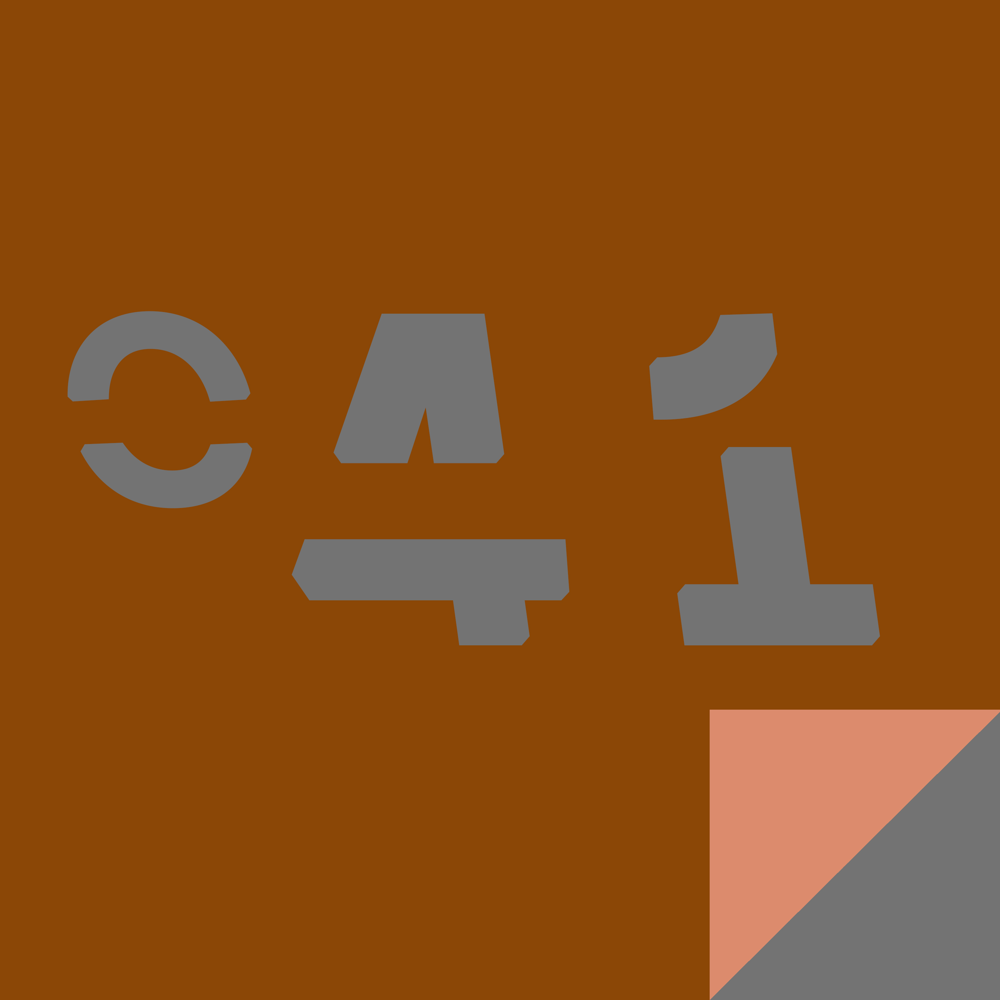

# Febbraio {-}

-- Jack e la trottola --

Jack poteva sentire la terra girare su se stessa e muoversi nello spazio, in orbita costante intorno al Sole. Aveva sempre avuto quella capacità, ci era nato.

Gli sembrava di vivere su un’enorme trottola lanciata nel vuoto. La cosa lo divertiva, del resto: a chi non piacciono le trottole? Così Jack raccontava a tutti quello che sentiva, immaginava storie su chi l’avesse lanciata quella enorme trottola. 

Un giorno Jack avvertì un sussulto, un’oscillazione improvvisa, terribile. Si ricordò che le trottole, prima o dopo, si fermano tutte. E la cosa non lo divertì più.

-- In ultima fila --

Al funerale di Gregor c’era davvero parecchia gente: sua madre, vestita a lutto, che gli aveva tolto il saluto anni prima, sua moglie, sorretta da quel suo caro amico d’infanzia con cui passava le sere e che stranamente la “consolava” da ben prima che Greg tirasse le cuoia; c’era pure il suo capo, che lo aveva sempre detestato, stava guardando l’orologio.

Dietro svariate panche colme di finti amici e finti parenti, in ultima fila, c’era anche Gregor, con una barba finta.

Non sarebbe stato difficile scoprirlo, se solo si fosse stati attenti: era l’unico che non faceva nemmeno finta di essere triste.

-- Gli orrori della guerra --

La dichiarazione di guerra di Giovannilandia (Uno stato indipendente autodichiarato nelle campagne venete, popolazione 1 uomo, 5 mucche, 12 maiali e 25 galline) fu consegnata al parlamento italiano il 17 dicembre 2012, senza nessuna risposta.

Una volta atteso un tempo che riteneva adeguato, sedici giorni (2 intere settimane, tre week end), Giovanni concluse che la mancata risposta equivaleva a una resa totale e incondizionata.

Mandò quindi una lista di richieste, che consistevano principalmente in una serie di riforme atte a conferirgli il potere sovrano sullo stato italiano. Questa volta Giovanni si assicurò di inviare la lettera con ricevuta di ritorno, per essere sicuro che il parlamento si mettesse immediatamente al lavoro.

Una volta ricevuta la notifica dell’avvenuta consegna, Giovanni si complimentò per gli strabilianti risultati ottenuti e tornò a mungere Caterina, la sua mucca preferita.

-- Muay Thai --

Incassò la ginocchiata al fianco. Sentì una costola incrinarsi, ma non poteva fermarsi. Spinse l’avversario a terra, per avere il tempo di riprendere il fiato. Quando l’altro si rialzò e l’arbitro diede l’ok sferrò un poderoso calcio basso. Il callo osseo sulla sua tibia era circondato da cicatrici e duro come un bastone di legno, aveva passato giorni e giorni a calciare alberi di banano per ottenere una tibia come quella. Il prezzo da pagare sarebbe stata la zoppia da lì a dieci anni, ma Pao Lang non ci pensava, contava solo la Muay Thai.

Colpì l’avversario al volto con un pugno, poi con una gomitata gli ruppe il sopracciglio. L’arbitro fermò l’incontro, l’avversario perdeva troppo sangue. Aveva vinto.

Pao Lang, dodici anni, alzò il braccio al cielo in segno di vittoria. Suo padre, a bordo ring, non lo guardava, stava riscuotendo i soldi della scommessa. Anche quel mese avrebbero mangiato.

-- Il desiderio --

Tom lanciava una moneta da un dollaro nel pozzo abbandonato ogni giorno, esprimendo sempre lo stesso desiderio.

I desideri di Ben erano molto più semplici da realizzare. Entrava nel pozzo una volta alla settimana e raccoglieva sette dollari.

-- Il bambino e la musica --

Quando venne al mondo una musica lo fece smettere di piangere.

Non seppe mai che strumento fosse e, quando divenne abbastanza grande da stringere il suo primo strumento, un flauto dolce di plastica blu, cominciò la sua ricerca. Non era il flauto lo strumento giusto. Provò con la chitarra, il piano, il clarino, l’oboe, la tromba, le nacchere e le bottiglie di vetro mezze vuote. 

Aveva 13 anni quando pensò che forse quella musica era il risultato di una magica alchimia tra strumenti diversi. Diventò un compositore e iniziò a riempire le pagine di note. Compose per piccoli gruppi di amici, che lo ringraziarono per aver dato loro il successo. Compose per la banda di paese e il maestro gli offrì una cena tutti i mesi di tutta la sua vita per ringraziarlo degli sguardi meravigliati che facevano i bambini che venivano a sentirli suonare. Compose per le grandi orchestre e si ritrovò ricco senza sapere perché. 

Ma nessuna musica era quella giusta, quel suono gli sfuggiva.

Mentre era in ospedale, a 78 anni, ebbe una intuizione e obbligò l’infermiera a telefonare ai suoi amici. Venne il figlio del maestro della banda del paese, vennero dei rocker internazionali pieni di rughe e vennero le persone cresciute con la sua musica: l’ala dell’ospedale si riempì di strumenti. Dal suo letto diede le istruzioni e tutti cominciarono a suonare. 

L’emozione di aver finalmente trovato la musica giusta forse lo uccise, ma lungo il corridoio, nella sala parto, un bambino venne al mondo e smise subito di piangere.

-- Il viaggio --

Si mise in cammino mentre il sole sorgeva. Gli sarebbe piaciuto portarsi dietro il suo riparo notturno ma sapeva che lo avrebbe appesantito troppo: non poteva permetterselo. La luce del mattino gli feriva gli occhi, era già stanco, esausto, ma non aveva scelta. Doveva continuare a camminare.

Il vento gelido gli sferzò la barba incolta un’ultima volta quando arrivò davanti alla soglia. Le decorazioni in vetro inserite nel legno riflettevano la luce del sole. Si appoggiò e spinse con tutte le sue forze.

Prima di sedersi sulla tazza del cesso accese la stufetta elettrica per scaldare la stanza.

-- Zeus --

L’elettricista si accarezzò la barba brizzolata <<Signora, temo che qui il guasto sia più serio del previsto, dovrò provare qualcosa di speciale, la centralina non risponde.>> Ovvio non rispondesse, era stato lui a prosciugarla da ogni energia.

La padrona di casa sbuffò portando una mano ai capelli. Era una donna di quarant'anni, ancora attraente. La gonna al ginocchio che portava evidenziava le forme giovanili.

L'elettricista si alzò e si avvicinò alla donna, più del necessario. Si accertò che lei notasse il suo fisico, ancora possente. Per uno che era in giro da tanto tempo quanto lui, era ancora in formissima. Le si avvicinò sfiorandole l'avambraccio.

<<Non si preoccupi, vedrà che risolverò il problema.>> La guardò negli occhi. La donna spostò il peso sulle gambe, cambiando posizione, poi si passò una mano sulla gonna, come a sistemare una piega invisibile. Lui continuò a guardarla negli occhi. <<Lasci che faccia la mia magia.>> Lei sembrava ipnotizzata dal blu intenso dei suoi occhi. Tremila anni e quel trucco funzionava ancora come la prima volta.

Schioccò le dita e con un suono secco, potente, e la luce tornò. 

La donna arretrò <<Come ha fatto?>>

Lui abbassò lo sguardo sul corpo di lei, poi tornò a fissarla negli occhi <<Questo non è niente.>>

Quando la donna si morse il labbro inferiore, seppe di avere vinto. Non che avesse mai avuto dubbi. Rimasero in silenzio per alcuni secondi, guardandosi, poi lei parlò ancora <<Come hai detto che ti chiami?>>

<<Mi chiamano e mi hanno chiamato in molti modi, ma nessuno di questi ha importanza ora.>> La baciò con passione, passandole una mano sul fianco e una dietro la schiena. Fu abbastanza delicato da non farle del male, ma abbastanza deciso da farle capire che era l'uomo più forte che l'avesse mai tenuta fra le braccia. 

Adorava l’era moderna: le donne erano fantastiche e non gli mancava il suo trono. I suoi figli, così come i suoi fratelli, si arrangiavano, ognuno a modo suo, e anche se non scagliava più i fulmini di persona da un migliaio di anni, finora nessuno se ne era lamentato.

-- Tra le due guerre --
La prima gli aveva tolto il padre, la seconda l’unico figlio.

### Storia 41 {-}

-- L’ultima ruota del carro --

Aveva provato a lamentarsi col Grande Capo, ma aveva rimediato solo frustate. Sentiva dentro di sé di avere qualcosa di più da offrire, eppure continuavano a umiliarlo. Era l’ultima ruota del carro, ne era consapevole, ma la cosa non gli stava più bene. Sognava di poter esprimere il suo vero potenziale, di diventare grande e potente e avere incarichi di responsabilità.

Mentre immaginava se stesso a capo di una legione infinita guidare l’esercito del Capo alla vittoria, per poco non si fece scappare il nodo. Rimediò in fretta, un garbuglio rapido, un lavoretto semplice, nulla di particolarmente raffinato. 

L’uomo estrasse dalla tasca le cuffie del lettore mp3, ritrovandole inevitabilmente ingarbugliate. Ci mesi dodici secondi per sciogliere il garbuglio. Non male per un lavoro fatto di fretta.

Atkron, demone infernale di centonovantaseiesimo livello, non ebbe il tempo di congratularsi con se stesso. Qualcuno da lì a pochi istanti avrebbe preso una chiave a caso dal mazzo, al buio, e provato ad aprire la porta di casa. Non poteva permettere che la chiave fosse quella giusta, sennò poi il Capo chi lo sentiva.

-- Condizioni d’uso --

<<...e quindi, se non ha altre domande, non le resta che firmare.>> l’uomo squadrò il grosso plico di fogli e lo girò sul tavolo, verso il ragazzo, indicandogli lo spazio per la firma.

<<Lei mi garantisce che non ci saranno conseguenze… di dannazione eterna, per così dire, per me?>> il ragazzo si passò la mano fra i corti capelli ricci.

Un sorriso si allargò sulla faccia dell’uomo, scoprendo una dentatura irregolare, ma bianchissima <<Comprendo la sua ritrosia, ma come le ho spiegato saremo soci, non intendo avanzare pretese sulla sua anima.>> L’uomo avvicinò al ragazzo lo schermo del suo computer portatile, mostrandogli una schermata con un form di iscrizione. Cliccò col puntatore del mouse sulla voce “condizioni d’uso” e scorse fino alla fine delle note <<Vede? E’ tutto scritto nelle note, ma nessuno le legge mai. I nostri tecnici hanno sistemato tutto, l’unica cosa fondamentale è che chi si iscrive inserisca i suoi veri dati personali. Io mi prenderò le loro anime, non la sua, e in cambio lei avrà ricchezza e potere per l’eternità.>>

<<Centinaia di migliaia di persone…>> il ragazzo spostò indietro il peso, schiacciandosi contro lo schienale della sedia in pelle nera, e si portò una mano alla fronte.

L’uomo sorrise ancora <<Milioni, signor Zuckerberg, milioni.>>

-- Per ogni grande storia… --

Il misterioso sconosciuto suonò al campanello accanto al suo, e la sua grande avventura finì prima di cominciare.

-- Norme di sicurezza --

“CAUTION: _LIVE PARTS INSIDE. SERVICING MUST BE PERFORMED BY QUALIFIED PERSONNEL ONLY”, recitava l’adesivo argentato sulla macchina.

Aveva letto l’etichetta due, tre volte mentre l’operatore gli sistemava la testa nell’ingombrante macchinario per la scansione. -Live... Buffo-, pensò il paziente, non conosceva abbastanza l’inglese da capire l’esatto significato di quella terminologia tecnica. Non ci pensò più, mentre irrigidiva la testa e faceva aderire la lingua al palato, come ordinatogli dall’operatore.

La macchina si attivò, con un ronzio. L’operatore lo lasciò solo, recandosi nella sala risultati per accertarsi del corretto esito dell’esame.

__

Nella sala computer lo schermo segnalò agli operatori un errore sconosciuto. Sul monitor apparve una casella di testo con alcune parole.
<<Non è possibile, cazzo, è la terza volta questa settimana. Chiama quelli dell’assistenza, bisogna che risolvano questa cosa o ci cambino la macchina. Ora mi tocca fargli rifare l’esame.>>

L’operatore tornò nella sala esami e si rivolse al paziente, con un sorriso: <<Sono spiacente, un imprevisto tecnico, la rifacciamo.>>

Nell’altra sala, sul monitor ultrapiatto illuminato, comparve ancora una volta il segnale d’errore e la casella di testo: “HE_LP ME IAM A_LIVE INSIDE.”

-- San Valentino --

A oltre duecento milioni di chilometri di distanza dalla Terra il Capitano Joe Wu scattò una foto al primo fiore marziano: una piccola zinnia arancione. Lo stelo era leggermente ripiegato su se stesso, di un verde sbiadito. Uno dei petali era molto più piccolo degli altri.

Joe allegò la foto a un messaggio e lo spedì al centro di controllo terrestre, specificando a chi dovessero girarlo. 

“Per Hao: non la solita rosa. Ti amo, Joe.”

-- Il pugile --

Il primo pugno lo raggiunse allo sterno, strappandogli il fiato che aveva in corpo. Quello più duro però fu il secondo, come un maglio d’acciaio diretto alla faccia, che gli fece masticare il paradenti e liberò nella sua bocca ancora una volta il sapore del sangue. Sorridendo, rialzò la guardia: non era finita.

Si svegliò di soprassalto, sudato nel grande letto vuoto. Stupido vecchio. I suoi occhi divorarono nervosi la stanza, saltando sull’angolo di un cassettone, su un cuscino a terra, le coperte strappate e una foto sulla parete, sbiadita ai lati, con lui che sollevava una coppa, felice.
Si rese conto, con stupore, che stava piangendo.

-- Vita Amara --

Il topo squittì. La luce intensa che aveva inondato la sua casa di coccio lo aveva accecato.

Cosa stava succedendo? Era l’apocalisse?

Si agitò tantissimo e corse fuori da un buchino nel vaso dove c’erano i suoi piccoli, che piangevano spaventati.

Un’ombra enorme si avvicinò e fece per raccogliere casa sua, il topo non poté fare altro che lanciarsi in salto e tornare dentro il vaso. Mentre tutto ballonzolava si strusciò contro i suoi piccoli per tranquillizzarli, sentì un forte puzzo di alcool e una voce incerta venire da fuori.

<<Dobbiamo portare in salvo l’antico vaso.>>

-- Supereroe --

Ai piedi del palazzo, il poliziotto trattenne il vomito mentre i ragazzi della scientifica raccoglievano i campioni.

Il sangue era schizzato per metri sul marciapiede, c’erano brandelli di carne e ossa ovunque: si allargavano come una rosa appiccicaticcia fino in mezzo alla strada.

Quello che rimaneva della maglietta, che forse era stata azzurra prima di essere inzuppata di liquame rossastro, aveva una grossa S stampata sul petto.

-- Alle porte della città --

Spronò il suo mulo e il suo carretto si trascinò vero le guardie cittadine, vestite di rosso e armate di picche. Una aveva delle occhiaie lunghe e bluastre, l’altra aveva una bottiglia di vino in mano. A nessuno importava davvero di controllare chi entrava e usciva, in tempi di pace.

La guardia sobria lo fermò, stordita dal sonno <<cosa trasporti?>>

<<Granaglie per gli animali, signore.>> rispose, e in qualche modo era vero.

<<Uh, niente da dichiarare? Soldi, merce di contrabbando?>>

Che domanda stupida <<No, signore, sono solo un pover’uomo, cosa potrei trasportare di prezioso?>> e di nuovo, era vero.

<<Uh. Certo certo. Il tuo mulo sembra a un passo dalla morte.>> disse la guardia stropicciandosi gli occhi.

<<Lo è signore. Ma forse ha vissuto abbastanza.>> Sempre vero, sempre vero per tutti quanti.

<<Ok, entra pure.>>

Spronò l’animale e il carretto cigolò sotto l’arcata di pietra. L’untore era entrato in città.

-- La pianta --

Ho implorato mia moglie di levare quel ficus di merda mille volte.

Niente, dice che sono un uomo adulto e che solo perché la lucina del corridoio lo fa sembrare una persona con un cappello non ho il diritto di farmela nei pantaloni.

E’ terrificante, cazzo.

Quando vado a pisciare, come ho appena fatto, devo passargli accanto e sembra guardarmi. Non riesco mai a riaddormentarmi e finisco per guardarlo per ore. Domani mattina la sveglia è alle 6, non posso starmene sveglio solo perché lei si è fissata.

Scuoto la mogliettina sdraiata accanto a me e lei si gira facendo frusciare le coperte, senza svegliarsi. Ha sempre avuto il sonno pesante, una volta in vacanza avevamo lo spazio tenda a cento metri dal pub del campeggio. Io sono tornato con due occhiaie da zombie, lei ha proposto di tornarci l’anno successivo. Insisto un po’, poi la pizzico al fianco. Lei si scuote in un dormiveglia irritato e allunga la mano per fermarmi.

<<Ora sposto il ficus, non riesco a dormire e non voglio sentire lamentele.>> Cerco di essere fermo e carismatico. In realtà spero che non avrà la forza di opporsi mentre è mezza addormentata.

<<L’ho spostato io ieri pomeriggio, ora è in cucina, lasciami dormire.>>

### Storia 51 {-}

-- Più veloce della luce --

L'universo è, a velocità superluminali, una improbabile quanto funzionale macchina del tempo: viaggia più veloce della luce e arriverai prima che l'informazione di un accadimento abbia raggiunto il punto in cui ti trovi.

Secondo i fisici questo è sufficiente a viaggiare nel passato, secondo il nostro cervello è solo un modo per guardare quel passato ancora una volta.

Per Mike, su quell'astronave, dopo la morte della moglie, era l'unico modo per rivederla viva un'ultima volta. Era sufficiente.

-- Una prigione --

Ingoiò l’ultima pillola della giornata insieme alla bevanda proteica. Un gusto intenso di vaniglia gli inondò la bocca.

Si guardò il braccio, coperto dalla manica grigia e lucida di un completo su misura. Era difficile superati i quarant’anni mantenere un fisico di quelle dimensioni, oltre agli allenamenti giornalieri aveva bisogno del supporto di tutta la chimica disponibile per l’aumento della massa muscolare. Le articolazioni cominciavano a dolergli e l’operazione al gomito dell’anno precedente rendeva ogni movimento con un manubrio in mano un’agonia. Doveva costringersi a mangiare sei volte al giorno, anche quando ormai non aveva più alcuna fame.

Avrebbe solo voluto smettere con le pillole e con i troppi allenamenti, permettersi di invecchiare, di dimagrire. Ci pensava da mesi ormai, ma non era neanche riuscito a dirlo alla sua ragazza, la modella che fingeva di amare e che tanto adorava i suoi muscoli. Non riusciva a parlarne, figuriamoci a farlo davvero. Non ne aveva il coraggio. Quel fisico lo aveva salvato da una vita di povertà e la sola idea di perderlo lo terrorizzava.

Uscì dalla limousine che lo stava accompagnando alla prima del suo ultimo film. Non ricordava neanche quale fosse, erano tutti dannatamente uguali. Fu investito dai flash e dalle grida. La folla lo amava e gridava il suo pseudonimo, che gli era rimasto cucito addosso dai tempi in cui lottava in mutande nella farsa chiamata wrestling.

Alzò le braccia facendo un gesto ampio, come per abbracciare tutti i suoi fan. Avrebbe voluto gridare, urlare loro di smetterla di chiamarlo con quello stupido nome, che aveva un cervello e che era un vero attore, non solo un coglione palestrato. Avrebbe voluto chiedere scusa per quel nuovo e già vecchio film, pessimo come tutti i precedenti.

Sorrise. Era l’ora di firmare gli autografi.

-- Chiodo fisso --
Matteo aveva un chiodo fisso, non riusciva a toglierselo dalla testa. Ci pensava tutto il giorno, soffriva e si tormentava. Non poteva più vivere così.

Stufo di piangere sul latte versato, si decise a rivolgersi a uno specialista, qualcuno che capisse il suo problema. Non un medico, per carità, cosa vuoi che ne capiscano quelli, un carpentiere.

Il carpentiere sulle prime sembró alquanto sorpreso, non aveva mai trattato casi simili, ma dietro lauto compenso accettó di estrarre il chiodo dal cranio di Matteo.

Finalmente libero, Matteo ringrazió il carpentiere e gli chiese se per caso conoscesse un calzolaio: gli rimaneva da risolvere quel problema del piede in due scarpe.

-- Favole per tempi moderni... Le due principesse --

In un regno lontano abitavano due principesse che non potevano essere più diverse.

Il re, loro padre, non aveva molto tempo per loro, perché governare un regno richiede un sacco di lavoro. Le amava però entrambe e desiderava che vivessero felici, così faceva in modo che avessero tutto quello che volevano.

La prima principessa aveva molti ritratti, tutti bellissimi come lei, appesi nella galleria del castello. Ogni volta che degli ospiti arrivavano al castello lei si offriva di far loro da guida, per mostrar loro i suoi ritratti.

<<Sono tutti pezzi unici>> diceva <<come me.>> e nessun ospite osava contraddirla, perché era la prima principessa e sarebbe diventata regina prima o poi.

La seconda principessa non aveva tempo per i ritratti, c’era così tanto da fare nel castello. C’erano le cucine, c’erano le biblioteche, le balie cantavano per i bambini dei nobili e i soldati si allenavano con le armi in cortile, nelle stalle c’erano i cavalli su cui amava cavalcare.

Sul letto di morte il padre le chiamò entrambe e quando furono vicino al letto si tolse la corona e la diede alla seconda figlia. La prima figlia guardò il padre e gli chiese <<Perché? Non dovrei essere io a diventare regina?>>

<<Perché essere unici non è poi così importante, figlia mia, se è l’unica cosa che sai fare.>>"

-- Rasoio --

La macchia di sangue, mescolata all’acqua e alla crema da barba, si allargava nel lavandino. Un’altra goccia rossa gli scivolò dal mento.
<<Merda.>>

Era il terzo taglio che si faceva quella mattina. Qualcosa di incredibile, non si era mai tagliato radendosi in tutta la sua vita. Usava ancora un rasoio a serramanico, affilato e preciso, col manico in legno laccato di bianco. Non aveva mai voluto passare ai rasoi moderni, in parte per abitudine, in parte per affetto verso quel vecchio oggetto, che aveva comprato chissà dove chissà quanto tempo prima.

Si tagliò un’altra volta prima di completare la rasatura. Appoggiò il rasoio, infastidito, si sciacquò il viso e si guardò allo specchio: sembrava fosse finito dentro un tritacarne, la faccia era irritata e piena di tagli ancora freschi.

Dopo essersi asciugato, diede un’altra occhiata veloce allo specchio. Alle sue spalle, nel riflesso,c’era una porta tinta di bianco. Una porta che non aveva mai visto prima. Si girò di scatto, ma sulla parete alle sue spalle non c’era segno della porta.

Mentre avvicinava il viso allo specchio, per osservarla meglio, sentì bussare. Veniva da dietro le sue spalle. Dopo alcuni istanti, la maniglia della porta nel riflesso si abbassò e la porta, senza emettere alcun rumore, si aprì.

Sulla soglia stava un uomo, con un cappello bianco. In mano teneva un rasoio, il suo rasoio, ancora macchiato di sangue."

-- Una Scala Reale di Cuori Spezzati --

J♣, Q♥. 2♠.

-- Ridere, ridere --

Quando la segretaria la fece entrare, notò che il Dottor Penguin aveva spostato il lettino lontano dalla finestra. Era una cosa sconvolgente. Nessuno si rendeva conto che quelli erano i suoi trenta minuti di sfogo? Ne aveva un bisogno disperato, soprattutto dopo una giornata come quella, e questi cambiamenti rischiavano di destabilizzarla completamente.

Il dottore si alzò dalla scrivania e le fece segno di sdraiarsi <<Mi dica, mi dica, è successo qualcosa di importante questa settimana?>>
Lei si sdraiò sul lettino e cercò di mettersi comoda prima di cominciare <<La gente non si rende conto di quanto sia stressante il mio lavoro. Credo di avere letteralmente qualcosa da fare ogni singolo istante. E poi non si può immaginare le pile di carte che devo consegnare alle Alte Sfere se qualcosa va storto. E’ estenuante.>>

<<Me ne rendo conto. Credo che sia importante che lei ricordi quanto è importante il suo lavoro per il mondo, no, per l’universo intero.>> disse il dottore.

<<Vorrei che me lo si dicesse più spesso. Invece stan sempre tutti a lamentarsi e a piangere miseria. Pensi che l’altro giorno a momenti mi veniva un colpo. Stavo in una città vicino a Samarcanda, un lavoro con una donna di trent’anni e cosa ti vedo? Uno dei miei appuntamenti ancora lì, fermo a festeggiare la fine di qualche guerra nella quale, fra parentesi, ad aver lavorato più di tutti ero ancora io.>>

<<Quale era il problema?>>

<<Il problema era che avrei dovuto incontrarlo a Samarcanda due giorni dopo e quel cretino era lontanissimo. Avrebbe dovuto ammazzare un cavallo per arrivarci in tempo. Stavo già immaginando tutte le spiegazioni che avrei dovuto dare al mio capo…>>"

-- Spazzatura --

Risolvemmo il problema dei rifiuti sulla terra quando i costi per spedire razzi nello spazio si abbatterono drasticamente. Cominciammo a riempire i razzi di spazzatura e a spedirla nello spazio, verso il sole.

Nuovi problemi sorsero quando i Solariani, che vivevano da miliardi di anni in pace nel cuore della stella, cominciarono a spedirci la loro, di spazzatura."

-- Mentre stai dormendo --

Roberto si addormentò alle 11 e 37, dopo una serata di studio, pensando a quanto sarebbe stato bello svegliarsi tra un mese, dopo la  sessione d’esami.

Alle 9 e 15 di mattina la sveglia suonò e Roberto entrò nel panico: era in ritardo, avrebbe dovuto svegliarsi per le 8. Guardò il calendario, che segnava il 2 di Marzo. Era trascorso un mese. Pensò a uno scherzo dei suoi coinquilini, ma internet e sua madre al telefono gli confermarono la strana verità.

Scoprì che la sessione d’esami era andata bene, che suo padre si era ripreso dalla brutta caduta e che era ancora single.
Così Roberto decise di fare un esperimento. Passò la giornata a pensare e poi la sera andò a letto presto, augurandosi di svegliarsi a luglio, in piena estate.

Si svegliò in un letto che non era il suo, fuori dalla finestra una spiaggia che non riconosceva, nel cellulare i messaggi di una ragazza che gli diceva che era stata bene la sera prima. Era come se la sua coscienza avesse oltrepassato il tempo, saltando a un altro momento della sua vita. Qualcuno viveva la sua vita, mentre stava dormendo.

Roberto era spaventato. Doveva smetterla, non farlo mai più. Ricostruì la vacanza dai messaggi e dalle foto su Facebook e trascorse una splendida giornata. Fece tardi in discoteca e quando tornò era distrutto e un poco brillo. Non si rese nemmeno conto del pensiero che gli passò per la mente, mentre collassava sul letto -chissà come sarebbe svegliarsi e avere ottant’anni-

Scoprì che era estremamente faticoso. Si svegliò alle 5 di mattina, il corpo pieno di dolori e debole, di fianco a lui c’era una donna, vecchia quanto lui, addormentata. Non la conosceva, eppure sapeva di amarla più di ogni altra cosa. Pianse, aveva perso tutta la vita mentre dormiva. Cercò di raggiungere il bagno e scivolò per terra, sbattendo la testa contro un termosifone. Mentre perdeva i sensi, con il sangue che gli imbrattava i capelli grigi, pensò a quanto sarebbe stato bello svegliarsi quella mattina di tanti anni prima, nella sessione di esami.

La sveglia suonò alle 8 in punto.

