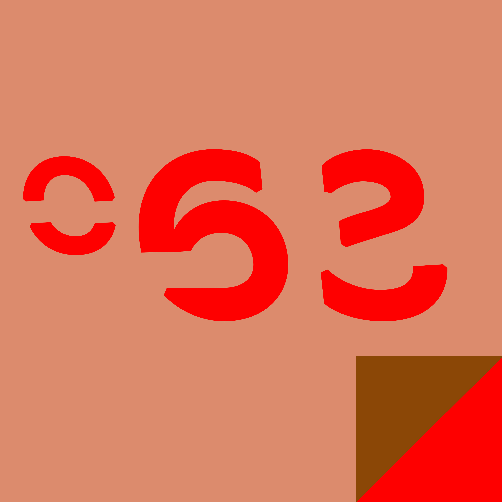

# Marzo {-}

-- Storia d’amore --

C’era lui e poi c’era lei. Ci fu un loro. E poi ancora lui e ancora lei. Ma non c’era più nessuno.

### Storia 61 {-}

-- Una vita avventurosa --

Il Blackberry cominciò a suonare, attivandosi e proiettando la fredda luce azzurrognola dello schermo nella stanza buia. Ci vollero quattro squilli perchè si svegliasse. Si tirò su dal letto con uno scatto, tastò il comodino finchè non trovò gli occhiali e il dispositivo elettronico. Lo schermo mostrava l’ora: le due e mezza della notte.

-Ossignore questa volta cosa sarà successo?!- <<Pronto? Sì... no cioè certo stavo dormendo, mi dica.>> La voce dall’altra parte del collegamento sembrava agitata. -Lo aveva fatto di nuovo.- <<E la ragazza dov’è adesso? La questura? D’accordo d’accordo ora provo a... come ha già chiamato lei? E che cosa ha detto? La nipote… >> Si passò una mano fra i capelli. -Cristo, non è possibile, non può averlo detto davvero.- <<O-ok vedo cosa posso fare. Ma va là, non si preoccupi. Sì, sì, domani passo in ufficio.>>

L’avvocato Ghidini chiuse la conversazione, si tolse gli occhiali e si passò le mani sul viso magrissimo. Sarebbe stata una lunga notte."

-- OGM --

<<“Un organismo, diverso da un essere umano, il cui materiale genetico è stato modificato in modo diverso da quanto si verifica in natura mediante accoppiamento o incrocio o con la ricombinazione genetica naturale.”>> L’avvocato si rivolse al giudice e ai suoi colleghi. <<E’ questa la definizione che la legge italiana attribuisce al termine OGM.>> Sulla parete alle spalle del giudice campeggiava la frase LA LEGGE E’ UGUALE PER TUTTI, in lettere capitali dorate.

<<Conosciamo la definizione, avvocato, arrivi al punto.>> Il giudice si sporse in avanti, appoggiandosi con gli avambracci sul banco in legno chiaro.

L’avvocato annuì <<Ebbene, la legge in questo senso è chiarissima, nel caso dei prodotti del mio assistito la categoria OGM non è applicabile, pertanto la coltivazione degli stessi non può essere considerata in alcun modo una violazione della normativa in materia né il mio assistito è in alcun modo tenuto a indicare la modificazione di tipo genetico applicata ai suoi prodotti, questo processo è una costruzione mediatica pretestuosa e priva di fondamento.>>

In fondo all’aula si alzò un uomo <<E’ ridicolo! Quello che fate è disgustoso, contro natura, vergognatevi!>> e iniziò a srotolare uno striscione verde. Alcuni attendenti lo accompagnarono all’uscita.
Prese nuovamente la parola il giudice. <<Avvocato, la sua posizione è chiarissima, ma converrà con me che il problema non si riduce a questo. Se quanto dice fosse accettato, quello che il suo cliente perpetra potrebbe essere definibile come una terribile violazione dei diritti umani fondamentali.>>

<<Questo, vostro onore, è tutto da stabilire. Chiamo a testimoniare MON-Y34, ibrido uomo-carota di terza generazione.>>

-- Caro Diario --
Lunedì - Ho un mal di testa incredibile, credo di aver finito le bottiglie di gin ieri sera. Ho ancora del Rum.

Martedì - Sono arrivato in giardino per un pelo prima di vomitare. Non avevo voglia di pulire. C’è ancora qualche bottiglia di vino in cantina, sa un po’ di aceto ma andrà bene.

Mercoledì - Nei supermercati ti cacciano se non ti sei fatto una doccia, non lo sapevo. Ora ho abbastanza roba da bere per un paio di settimane, sia per me che per lei.

Giovedì - Alzato alle tre di notte per pisciare, non sono riuscito a riaddormentarmi fino alle undici del mattino.

Venerdì - Ora siamo sposati.

Sabato - Ho cercato di mettere a posto lo stomaco con una fetta di torta che ho trovato in frigo, sono andato in bagno per tutto il giorno.

Domenica - Ho quasi finito il gin, di nuovo, e non trovo il resto delle bottiglie.

-- Alla fine dell’arcobaleno --

Trovò la pentola piena d’oro, esattamente dove indicavano le leggende, e la portò via con sé.

Loro non ne furono per niente felici e così decisero di prendere provvedimenti. A Loro non piace affatto essere derubati."

-- Comunicazione --

Al terzo piano dell’edificio ospitante la facoltà di psicologia, nell’area dedicata agli studi sulla psicologia della comunicazione, il professor Koinberg alzò la cornetta del telefono e se la portò all’orecchio. Annuì, scambiò alcune frasi amichevoli con l’interlocutore dall’altro capo della linea, poi riattaccò.

Il suo ultimo libro “Brand management: la costruzione dell’esperienza identitaria emotiva”, stava andando bene. Diversi esperti del settore avevano espresso apprezzamento per le sue teorie, in particolare per il concetto di “post-emotion framing”, che aveva menzionato nell’ultimo capitolo del libro, e gli chiedevano per tramite del suo editore di tenere una conferenza sull’argomento

Non gli restava che capire cosa volesse dire, o inventarlo. Poi avrebbe accettato.

-- Lo studente migliore --

Nangila entrò nell’aula, accompagnato da due suoi sottoposti. Dalla cintura gli pendeva un grosso machete, dalla lama incrostata e sbeccata. Uno dei suoi sottoposti teneva una pistola nei pantaloni, ben visibile. Gli altri studenti si fecero da parte, in silenzio. Tutti sapevano chi era Nangila Kobaka e cosa faceva, il suo nome a Nairobi metteva paura.

Un ragazzo, che era intento a correggere insieme al professore un compito d’esame e non si era accorto di nulla, venne spinto via di peso dai nuovi arrivati. Nangila sbattè le mani con forza sul lungo tavolo. Il professor Githu, titolare del corso di Metodi Statistici per la Gestione Aziendale alla facoltà di economia, cominciò a rovistare tra i compiti dell’esame.

Nangila si sporse in avanti <<Non ho tutto il giorno, ho da fare.>> disse al professore.

<<Sì, sì solo un istante… eccolo.>> il professore estrasse un foglio protocollo dal plico.

<<Nangila Kobaka…>>

<<Lo so il mio nome.>>

<<S-sì, ma certo. Ecco il suo elaborato.>> Nangila glielò strappò dalle mani. Le pagine erano prive di correzioni, con l’eccezione di un piccolo segno rosso nella seconda facciata. Nangila fece una smorfia, poi gettò il compito al professore. <<Ho sbagliato.>> Tirò fuori dalla tasca posteriore dei pantaloni un libretto universitario, stropicciato e sporco. <<Registra e firma.>>

Il professore prese il libretto <<Lei ha preso il punteggio più alto, è il miglior studente di quest’anno.>>

Nangila scattò in avanti e afferrò il professore per il bavero, lo fissò negli occhi <<Lo dici come se non ci credessi. Pensì che abbia copiato? Pensi che non abbia il cervello per studiare?>> Sputò sulla cattedra <<Io sono quello che sono perchè non sono uno stupido.>> Mollò la presa.

Il professore compilò in fretta la registrazione del voto e ridiede a Nangila il libretto. Nangila Kobaki fece un cenno ai suoi sottoposti, poi uscì dall’aula rapidamente. Aveva del lavoro da sbrigare e poi sarebbe tornato nel suo appartamento. Mancavano pochi giorni all’esame di Teoria della Finanza e aveva bisogno di ripassare.

-- Artemide --

Adorava il suono che facevano le scarpe col tacco alto sui pavimenti di marmo. Tlak, tlak, tlak, tlak. Scandivano il tempo prima della caccia. Tlak, tlak. Pling. L’ascensore le si aprì davanti, c’erano due uomini in giacca e cravatta dentro.

Entrò e pigiò il tasto per il quarantasettesimo piano. L’uomo alla sua destra non aveva dormito, il suo corpo odorava di stanchezza. L’uomo alla sua sinistra si era immerso in una colonia da 150 euro la bottiglia. Non se ne rendeva conto, ma puzzava di culo di cervo.

Pling. L’uomo stanco uscì e altre cinque persone entrarono. Alcuni di loro erano cacciatori, come lei. Gli altri erano prede e non sarebbero durati a lungo. Poteva sentire la fame di sangue dei cacciatori renderle omaggio, mascherata dietro cravatte di seta e tailleur. Molto tempo fa aveva dei templi nelle foreste, era la vergine cacciatrice. Lasciarsi alle spalle quella storia della verginità era stata la migliore idea della sua vita. Pling, pling, pling, i piani passarono uno dopo l’altro, come le persone accanto a lei, in una bizzarra metafora della sua esistenza immortale. Il suo puzzolente fratello l’avrebbe apprezzata.

Pling. Lo schermo digitale segno il suo piano e lei uscì, tornando a camminare sul marmo. Tlak, tlak tlak. Alcuni suoi compagni di caccia si unirono a lei senza salutarla. Il branco attraversò una porta di vetro e tutti si accomodarono su poltrone imbottite. Lei estrasse le sue armi e le dispose in ordine davanti a sé. I suoi compagni fecero lo stesso e il tavolo trasparente si riempì di fogli di carta.

Pling. Dall’altra parte dell’ufficio l’ascensore si aprì di nuovo. Lei fu l’unica a sentire davvero il suono, ma l’intero branco sembrò percepirlo. Le prede erano arrivate.

-- Comunicato --

Terrestri, contrariamente a quanto riportato nei vostri film e libri, non abbiamo nessun bisogno di attaccarvi in forze, sterminare la popolazione del vostro pianeta e conquistarlo.

Però lo faremo lo stesso. Sarà divertente.

-- Leonardo --

<<Continua. Mi hai capito? Vuoi rimanere un grassone?>> Leonardo battè una mano sulla spalla del suo cliente, avvertì il sudore che impregnava la sua maglietta. Puzzava da fare schifo. <<Non dimagrirai se ti arrendi. Corri, cazzo!>>

L’uomo davanti a lui annuì boccheggiando, con la faccia tonda e arrossata. Continuò a correre sul tapis roulant per alcuni secondi, poi cadde in ginocchio. Leonardo fermò la macchina, impedendo all’uomo di rotolare giù dal tappetino.

<<Non ce la faccio. Non ce la farò mai.>> Disse l’uomo, le lacrime e il sudore erano indistinguibili mentre colavano sul triplo mento. Il suo corpo obeso era scosso da tremiti.

<<Stronzate, scuse.>> Leonardo si sedette a terra, vicino al suo cliente. <<Lascia che ti racconti una storia: non sono sempre stato così come mi vedi adesso.>> Leonardo si toccò il petto <<Un tempo ero uno schifo, non quanto te ma poco ci mancava, patetico, fuori forma. Poi ho deciso di cambiare ed eccomi qua. E sai cosa faccio ogni giorno?>> Guardò il cliente negli occhi <<Quando mi alzo dal letto o ci torno la sera guardo una foto di quando ero grasso, per ricordarmi che niente è impossibile.>>

La lezione proseguì, tra sbuffi e cadute, per un’altra mezzora. Poi Leonardo si cambiò e tornò a casa, consumò una cena veloce e si buttò a letto. Prima di spegnere la luce guardò, come sempre, la foto sul comodino, di un uomo sovrappeso a fianco di una ragazza. La foto di quando era grasso, di quando lei c'era ancora.

-- C’è un drago nel mio garage --

<<Ti dico che è qui, davanti a te, ed è pure incazzato.>>

<<Smettila di dira stronzate.>>

<<No sul serio, è invisibile, non provocarlo, non saresti il primo che divora.>>

<<Oh, non dovrei provocare il terribile drago invisibile che vive nel tuo garage?! Ma certo, chissà che potenti denti impalpabili che ha e che fuoco invisibile che… >>

Ma il fuoco non fu affatto invisibile, nè i denti furono impalpabili.

### Storia 71 {-}

-- Finale --

<<Nessuno ha mai amato nessun altro quanto io ho amato te>> disse Bella ad Edward, sul megaschermo riservato per la proiezione in anteprima.

Vlad applaudì stancamente mentre aspettava che le luci si riaccendessero. Schivò i due giornalisti in cerca delle opinioni della gente sul film e uscì in strada. Sospirò e infilò la mano dentro la giacca. Aveva sperato di poterlo evitare ma dopo tutto quello che aveva visto era impossibile.

Si infilò il paletto nel petto.

-- L’unica soluzione rimasta --

<<Eliminata ogni alternativa l’unica soluzione rimasta, per quanto incredibile, deve essere quella giusta.>> Mr. Boyd guardò gli altri uomini seduti nel salottino. Diede un sorso al suo brandy invecchiato. <<Questo diceva Sherlock Holmes, nelle opere del nostro compianto connazionale Sir Arthur Conan Doyle. Pur essendo opere d’invenzione spesso al limite della letteratura fantastica, ho sempre ritenuto quelle parole un insegnamento importante per ogni investigatore.>>

L’ispettore di polizia lo guardò con aria perplessa. La vedova Hartley ascoltava con interesse. Mr. Pocroach sembrava aver perso ogni interesse nella conversazione.

Mr. Boyd continuò. <<Ho vagliato ogni possibile alternativa per la soluzione di questo caso. Solamente io stesso, la signora Hartley e Mr. Pocroach avremmo avuto l’occasione di assassinare il nostro caro Lord Hartley, che tutti e tre conoscevamo piuttosto bene.>> si rivolse al suo assistente, il quinto uomo nella stanza <<Gentilmente Trent, mi passi il mio revolver, non vorrei che il colpevole, che si trova in questa stanza, compisse gesti inconsulti.>> 

L’assistente estrasse l’arma dalla giacca e la consegnò all’investigatore con prontezza. 

<<La signora Hartley e Mr. Pocroach sono innocenti, non c’è alcun dubbio.>>

L’ispettore si alzò in piedi <<Ma allora…>>

Boyd puntò l’arma verso il poliziotto <<Ricorda, ispettore? L’unica soluzione rimasta… >> Fece fuoco.

-- La torre --

Aveva cominciato con una biblioteca a un solo piano: gli piaceva studiare e capire il mondo e i libri erano il modo più veloce per farlo. Li aveva collezionati per tutta la vita e ogni due o tre anni aveva dovuto aggiungere un piano alla biblioteca.

Era ormai vecchio quando si rese conto con stupore, guardando dall’ultimo piano della sua torre, che il mondo da lì sembrava piccolo e distante.

-- La Medusa Bianca --

Al di fuori dell’oblo di pietra lumina poteva vedere le foreste di alghe del fondale che si avvicinavano. Mancava poco. Non riusciva a vedere nessuna delle enorme meduse da acido di cui erano a caccia, ma non era importante. La sentinella sull’arco galvanico aveva la strumentazione per rilevarle, presto qualcosa sarebbe saltato fuori.

Uscì dalla cabina e zoppicò nel corridoio, con il capo chinato, fino all’armeria. Il fabbro di bordo era riuscito a ricavare una fiocina dal plasma solido rimasto, dopo che quella precente era andata persa, infilzata nell’ombrello di una medusa arancione. A volte nella foga della caccia riusciva a dimenticare la sua vendetta e la foga si impossessava di lui. O forse tutte le meduse che cacciava nella sua mente erano come l’ombra nera che gli aveva strappato la gamba e quello che si impossessava di lui non la foga, ma lo spirito della vendetta.

Non lo sapeva.

Afferrò la fiocina e si diresse sul ponte di prua. I suoi cacciatori stavano indossando le tute. Ogni tanto gettavano lo sguardo verso la gemma di criospina inchiodata sul pilone centrale. Sarebbe stata sufficiente a comprarsi un castello.

Un fischio acuto venne vomitato dai corni di diffusione. La sentinella aveva scovato qualcosa. Forse era la volta buona.

-- L’ultima corsa --

Trattenne il vomito mentre si raggomitolava a terra, con gli spasmi che gli attraversavano i polpacci e la schiena che implorava pietà.
Due ore di corsa ogni giorno. Dopo il lavoro, tutti i giorni. Era crollato a letto tutte le sere negli ultimi due mesi, il fisico di un cinquantaquattrenne non era fatto per sforzi di quel genere, lo sapeva benissimo, la moglie glielo aveva ricordato continuamente e i colleghi di lavoro avevano riso di lui.

“Davvero pensi di riuscire a finire una maratona con quel fisico?” “Avresti dovuto cominciare ad allenarti due anni fa, invece di ammazzarti di ciambelle” “Ahahahahahaah” “Ridicolo” “Non ce la farai mai” “Non puoi farcela” “Non ti rendi conto che è tutto inutile?”

Il sangue che rimbombava nelle orecchie gli impediva di sentire le persone che urlavano intorno a lui, a malapena riusciva a vedere quello che stava succedendo. Il traguardo era ancora distante, 500, forse 700 metri. Una fitta al cuore mise in chiaro che non poteva farcela.
Avevano avuto ragione loro. Non era nemmeno sicuro che si sarebbe stato ancora vivo da lì a un minuto, di certo non avrebbe raggiunto il traguardo. Avevano avuto ragione loro.

E non gli importava, perché sdraiato a terra a metà della gara non c’era nessuno dei suoi colleghi, non c’era sua moglie e non c’era quel ragazzino abbronzato che aveva riso quando lo aveva visto vomitare durante gli allenamenti.

C’era lui.

Svenì mentre un paio di braccia lo sollevavano.

-- Il concilio degli Ent --

L’ultimo concilio degli Ent risaleva a diverse ere prima. Non amavano incontrarsi, preferivano rimanere nel loro tranquillo sonno di alberi. Eppure, dopo tanto tempo, un incontro tornava ad essere necessario. Avrebbero discusso per centinaia di anni, come il loro solito, ma alla fine avrebbero capito come gestire il problema degli umani.

Quando il primo degli Ent ebbe pronunciato metà della frase d’apertura dell’incontro, già cinque di loro erano stati abbattuti. Quando ebbe finito la frase, cominciò a sentire il morso di una sega alla sua base.

-- Paradosso --

<<Capite bene.>> Il professore si allontanò dalla lavagna <<che a causa di questo la teoria per la quale il numero di dimensioni alternative sarebbe infinito è del tutto inconcepibile. Il numero di dimensioni parallele deve essere un numero finito.>>

Una studentessa alzò la mano. <<Mi scusi, riuscirebbe a farci degli esempi? Non mi è chiarissimo il motivo per cui sarebbe impossibile.>>

Il professore si girò ad osservare la lavagna per un istante. <<Sì, mi faccia pensare… Il concetto è che se esistesse un numero infinito di dimensioni parallele tutte le condizioni possibili dovrebbero essere realizzate, nel complesso, contemporaneamente. Mi segue?>>

La studentessa annuì <<Sì, quindi tutto ciò che è possibile da qualche parte starebbe avvenendo in questo esatto istante.>>

<<Precisamente.>> Il professore indicò lo schema alla lavagna <<Quello di cui vi sto parlando, la scoperta del professor Stainbowe, rende teoricamente possibile aprire una porta da una dimensione all’altra. Se davvero le dimensioni fossero infinite, dato che abbiamo appena dimostrato che è possibile attraversarle, significherebbe che un infinito numero di civiltà aggressive potrebbe decidere di conquistare il multiverso.>> Il professore sorrise <<Simultaneamente, un infinito numero di civiltà proverebbe ad opporsi alla conquista, e un infinito numero sarebbe neutrale e un infinito numero non ne sarebbe consapevole e così via. Vi rendete conto che è un paradosso, è assurdo.>>

__

Dieci anni più tardi, anche Terra-x38(a)45t fu coinvolta nella Guerra Dimensionale Infinita.

-- Quello che le donne non sanno --

Dall’altra parte del vetro, osservò la donna che amava stringere il loro figlio appena nato. Non provò neanche a fermare le lacrime: era il momento più bello del giorno più bello della sua vita.

Pensò per un secondo a quello che gli ripeteva sua madre, tempo prima: gli uomini non sapranno mai quanta gioia si prova nel tenere in braccio per la prima volta il proprio figlio, dopo il parto. In quel momento capì quanto era vero quel semplice stereotipo.

Sorrise, asciugandosi le lacrime e guardando il suo bambino, così fragile. Le donne non sapranno mai quanto amore e quanta fiducia si provino verso la propria compagna per affidarle un compito tanto importante.

Aspettò che l’infermiera gli aprisse la porta e andò dalla sua famiglia.

-- Sangue freddo --

Compose il numero a tre cifre sulla tastiera touch del telefono. <<Polizia? Sì, mi chiamo Michael Correnant, vorrei denunciare un omicidio con arma da fuoco.>> guardò l’orologio da polso. <<Sì, avverrà fra meno di un minuto, esattamente al...>> Comunicò all’agente l’indirizzo e l’ora. <<L’assassino è un uomo di carnagione chiara, capelli castani, alto poco più di un metro e ottanta, indossa…>> descrisse l’abbigliamento e l’aspetto dell’assassino all’agente con dovizia di particolari. <<No, non conosco il suo nome. Suppongo sia per una questione di denaro. Sì, la vittima sono io. Mi sono infilato in una stanza senza uscita e non ho alcuna speranza di sfuggirgli. La ringrazio.>>

L’assassino ci mise più del previsto a trovarlo. Ingannò l’attesa controllando le mail del giorno.

-- La torre --

Sotto il suolo, in una grotta sconfinata, la torre si alzava nell'oscurità. Era coperta di muffa e umidità e un alone malvagio si irradiava da essa, pungente e fetido.

Il gruppo di avventurieri, il prode Knor, delle terre del sud, il paladino Amr e Joanna, la ladra arrivarono davanti al portone arrugginito facendosi luce con una torcia.

Il nobile paladino rimase pietrificato davanti ai cadaveri impiccati e sanguinanti che trovarono al primo piano della torre.

Quando incontrarono il fantasma di una donna che piangeva sua figla Knor non resistette e abbandonò la missione per tornare a casa, da suo figlio.

Solo Joanna arrivò in cima alla torre, dove un ragazzo triste e solo le porse il suo cuore. Era nato con il dono della magia e aveva sempre avuto tutto quello che desiderava e questo lo aveva trasformato nel ragazzo malvagio che aveva creato la torre. La solitudine lo aveva portato a strapparsi il cuore e ora lo porgeva alla prima persona mai arrivata fino a lui.

Joanne lo abbracciò invece di fuggire e quel singolo gesto portò la pace e sconfisse la malvagità della torre.

### Storia 81 {-}

-- L'escapologista --

La chiave nascosta nella manica non era quella delle manette.

-- Serie TV Poliziesche --

I caratteristici titoli di testa bianchi su fondo nero occuparono lo schermo. Era la quarta puntata di Law & Order che vedeva quel giorno, più tre puntate di Criminal Intent, due di Motive e una di Criminal Minds. Un paio di Bones e se ne sarebbe andato a letto.

Annotó le ultime cose sul suo blocco a quadretti durante la pubblicitá, prima dell'inizio della nuova puntata. Strappó il foglio e lo piantó sul muro con un grosso coltello da cucina, vicino agli altri.

Ancora qualche settimana e sarebbe stato pronto. Aveva imparato molto, nessuno lo avrebbe mai preso.

-- L'importanza dei dettagli --

<<Signor Rossi, l'operazione è andata benissimo. L'asportazione del polmone destro non ha dato alcun tipo di problema e nei prossimi mesi dovrebbe essere in grado di tornare a condurre una vita normale.>>
Il signore Rossi lo guardò sbarrando gli occhi <<Il... destro?>>

--Germofobia --

Si lavava per ore. Nonostante il suo lavoro lo portasse spesso a parlare di fronte a un grande pubblico, non stringeva mai la mano a nessuno. Cambiava decine di guanti in lattice alla settimana, non toccava niente che potesse entrare in contatto con altre persone. Dopo aver utilizzato un oggetto lo inceneriva e si assicurava di disinfettare ogni residuo.
Non era ipocondriaco né soffriva di disturbo ossessivo compulsivo: lo faceva per gli altri. Ci aveva convissuto per decenni, con i germi, sapeva quanto potessero essere pericolosi e non voleva passarli alle altre persone.

Quando parlava dei germi e cercava di spiegare perché non volesse avere contatti diretti con altre persone, nessuno lo prendeva sul serio. Pensavano fosse malato di mente.

Un giorno si ritrovò ad assistere a uno spettacolo di un famoso ipnotista, il quale lo scelse per un numero. Lui non se la sentì di rifiutare. Non strinse la mano dell’ipnotista, salendo sul palco, e sottovoce gli spiegò di avere un problema di germi e che sarebbe stato meglio se non ci fossero stati contatti fisici diretti. L’ipnotista annuì e gli sorrise. Durante lo spettacolo l’ipnotista gli fece sfilare il guanto in lattice e lo convinse con la suggestione a stringergli la mano. Una stretta di mano vigorosa, sincera, pelle su pelle.

Il giorno dopo lo spettacolo l’ipnotista avvertì un malore. Otto settimane dopo, il Presidente dichiarò lo stato di emergenza nazionale e istituì un coprifuoco permanente; otto mesi dopo, non era rimasto più nessuno a rispettarlo.

-- I problemi della regalità --

L'imperatore si alzò intorno alle 3 del pomeriggio. Aveva fame e si presentò maestosamente in cucina.

Gli venne servito del salmone. Lui ne assaggiò un paio di bocconi e lo lasciò lì. Aveva già mangiato salmone, quella settimana, qualcuno avrebbe pagato per quell'errore.

Si gettò tra le gambe del suo servitore donna, cercando di farlo cadere, senza successo.

<<Miao>> disse, facendo chiaramente capire che per quella volta avrebbe lasciato correre, ma che la sua pazienza stava finendo.

Uscì dalla stanza alzando la coda. Aveva dormito solo 12 ore, quel giorno, e aveva bisogno di riposarsi.

-- La scalata verso il successo --

Vidi uno per la prima volta uno di questi esseri dalla finestra del mio ufficio al primo piano, stava cercando qualcosa nel cassonetto dei rifiuti dall’altra parte della strada. Io leggevo una circolare, credo, o qualcosa di simile e mi fermai per fissarlo. Indossava un completo grigio con gli orli delle maniche e dei calzoni insozzate di una sostanza giallastra, unta. Scuoteva a destra e a sinistra l’enorme bocciolo che usciva dal colletto della camicia. Era ancora chiuso dal calice verde, a malapena si vedevano i petali violacei. Grande come una testa umana, una specie di pallone da rugby verde e viola. Rimasi a guardarlo per un’ora mentre infilava i guanti bianchi nel pattume per tirarne fuori una buccia di banana, una cartaccia colorata o un torsolo di mela e poi gettarli tutto dietro di sé, in mezzo il vicolo.

Lo rividi, lui o un altro come lui, un paio di settimane più tardi, mentre il mio autobus passava davanti a un fast food. Serviva dei clienti alla cassa, con un completo ancora più liso e lercio di quello della prima volta. Il fiore sulla sua testa cominciava appena ad aprirsi. Nella manciata di secondi nei quali riuscii a fissarlo servì due persone, nessuna delle due sembrò accorgersi di nulla.

Cominciarono a comparire delle pubblicità di un locale sulla sesta, sui cartelloni della mia zona.

C’era uno di quegli esseri che cucinava hot dog e sporgeva il suo fiore quasi sbocciato verso di me. Anche stampato su carta il suo vestito sembrava lurido. -Flower Burger-, riportava il cartello in caratteri pacchiani. Chiesi a un paio di persone cosa ne pensassero ma a New York la gente per strada non ha tempo da perdere e venni ignorato.

Andai a cercare quel locale sulla sesta ma quando ci arrivai il ragazzo alla cassa mi disse che il capo non c’era, che forse era nel loro altro locale, in centro. Non riuscii mai più a vederne neppure uno, di quei cosi, ma i Flower Burger ormai sono ovunque in città.

Sembra che stiano cominciando a comparire un po’ ovunque, in giro per gli Stati Uniti d’America.

-- Essere Previdenti --

Mise da parte un euro ogni giorno, risparmiando su caffé e sigarette, per essere pronto in caso di emergenza. Per quattro lunghi anni.

Quando l'emergenza arrivò davvero, i soldi non bastarono a risolverla, ma almeno aveva un sacco di soldi da spendere in caffé e sigarette."

-- La poesia, la colomba e la donna --

Il poeta grattò la penna d'oca intinta nell'inchiostro sul minuscolo pezzo di pergamena. Parola dopo parola, cercò di trasformare in poesia il suo amore per Galania, la sua musa.

Quando ebbe finito afferrò la colomba e legò alla sua zampa il piccolo rotolo. L'uccello era incantato e sarebbe andato esattamente dove era necessario. Il poeta lo liberò fuori dalla finestra e tornò a pensare alla sua bella irraggiungibile.

La colomba volò tra le nuvole e attraversò i monti. Quando la città dove Galania abitava fu in vista deviò e atterrò sul davanzale di una finestra.

Una donna, che non era Galania, stava piangendo con il cuore spezzato. Quando vide la colomba la afferrò e sciolse il cordino che legava la pergamena alla sua zampa.

La donna capì subito che la poesia non era per lei, che non aveva i capelli dorati e le labbra turgide, ma era una composizione talmente bella che le riparò il cuore.

Galania, in fondo, non aveva bisogno di un'altra poesia.

-- Enorme --

Schiacciò il ragno, investendolo con il pickup.

-- C'era una volta... - Cappuccetto Rosso --

<<E non dimenticare il pane fresco, lo sai che la nonna ne va matta.>>
Cappuccetto Rosso prese il cestino, pieno di cibo, dalle sue mani. <<Mamma ma tu non mi accompagni?>> 

Era diventata grande, con quelle treccine che le incorniciavano il volto. Non era ancora una ragazza, non era più una bambina.

Lei la guardò, sorridendo. <<Ormai sei abbastanza grande.>> Le accarezzò la testa coperta dal cappuccio vermiglio <<questa volta puoi andarci da sola.>> Aprì la porta con un cigolio, lasciando uscire la figlia. <<Mi raccomando però, fai attenzione al lupo.>>

Guardò Cappuccetto avviarsi verso il bosco. Non riusciva a smettere di sorridere. Si levò di dosso gli stracci con cui era vestita e corse nuda in soffitta. Dovette aiutarsi spingendo con le spalle per aprire la porta, liberando uno sbuffo di polvere. L’ambiente odorava di muffa e di legno marcio. Recuperò dal fondo di un baule chiuso a chiave un lungo coltello arrugginito, gettando uno sguardo agli altri cappucci, inchiodati con lunghi pezzi di ferro alle pareti: le macchie di sangue rosso scuro si allargavano meravigliosamente sul tessuto, ma il colore della tela di cui erano composte in qualche modo stonava. Verde, blu, bianco, erano colori senza vita. Non erano perfetti. Poi prese la sua pelle. Rabbrividì di piacere sentendo l’ispido dei peli strusciarsi sul suo corpo nudo. La indossò, e nel farlo le scappò un piccolo ululato di soddisfazione. Si sentiva di nuovo viva, come una volta.

<<Ormai sei abbastanza grande.>>"
