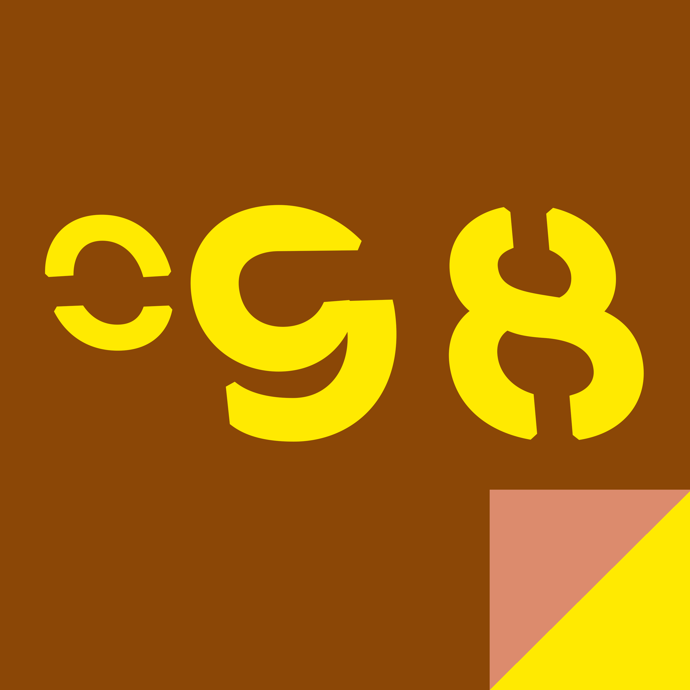

# Aprile {-}

### Storia 91 {-}

-- Doug & Dave --

<<Come potete notare dalle immagini, i cerchi si sviluppano tutti in senso anti-orario. Ci sono varie teorie al riguardo, personalmente credo che dipenda dalla natura del vortice plasmatico...>> Il relatore fu interrotto da un suo collega, in disaccordo, il quale riteneva che i cerchi nel grano non fossero frutto di un fenomeno naturale, bensì di un'intelligenza aliena, decisa a comunicare con gli umani tramite un codice misterioso. Il senso anti-orario doveva per forza avere una valenza simbolica, non poteva essere un caso che tutti i cerchi conosciuti andassero in quella direzione.

Dave, seduto in platea, in fondo alla sala, posò la penna sul piccolo taccuino che aveva in mano. -Senso orario.- Si voltò verso l'amico, sorridendo. Doug ricambiò il sorriso e annuì, assestandosi il berretto col frontino sulla testa.

Il sabato successivo un nuovo cerchio sconvolse il mondo degli appassionati: tre cerchi concentrici, tutti e tre sviluppati in senso orario. Qualcosa di mai visto prima.

Mentre in un furioso scambio di argomentazioni ufologi ed esperti di cerchi dibattevano del significato di quella scoperta, Doug e Dave guardavano la partita di calcio al pub, sorseggiando una birra media. 
<<Cazzo, Dave, il prossimo facciamolo a forma di area di rigore.>> 
Dave scoppiò in una sonora risata. Si sarebbero divertiti ancora a lungo.

-- Frammenti --

Aveva lasciato un pezzetto della sua anima ad ogni uomo di cui si era innamorata.

Quando trovò la persona giusta scoprì che il frammento spezzato che le era rimasto combaciava con quello del suo ultimo amore.

-- Crisi di mezza età --

Si stropicciò gli occhi mentre il cameriere si riprendeva i menù. Claudia allacciò la bavaglina al bimbo e avvicinò il seggiolone. Sembrava stanca morta anche lei, struccata e con le occhiaie rossastre. 

Gli ultimi due anni erano stati… difficili. Non era così che si era immaginato i suoi trent’anni.

Fu allora che vide Serena entrare nella pizzeria. Aveva addosso una magliettina bianca semitrasparente. Erano passati… forse cinque anni da quando l’aveva vista l’ultima volta. All’ultima riunione della classe?
Sua moglie parlava al piccolo per tenerlo tranquillo, l’ultima cosa di cui avevano bisogno era che si mettesse a piangere per la fame. Non si era accorta di Serena.

L’imbarazzo lo irrigidì. Non aveva mai superato la cotta che aveva avuto alle superiori per Serena. Con Claudia non era mai venuto fuori, almeno non esplicitamente.

Sua moglie si girò verso di lui <<Potresti… forse…>> aveva i capelli in disordine.

<<Certo che posso!>> allargò le mani e fece finta di lanciare neve tutto attorno <<LET IT GO LET IT GO>>

Il bimbo lo fissò, si mise a ridere e a battere le mani grassottelle. Serena, e l’uomo barbuto che si era unito a lei, si sedettero dall’altra parte della sala.

No, non era di certo così che si era immaginato i suoi 30 anni. Ma era felice lo stesso.

-- Il piano malvagio --

Charlotte, la farfalla, mise in atto il suo piano una mattina d’estate. Svolazzò cambiando spesso direzione per essere sicura di non essere seguita, si posò su un fiore di campo che aveva selezionato con attenzione e attese.

Quando il sole gettò la giusta ombra sbatté le ali una singola volta, mettendo in moto una malefica concatenazione di eventi che portò un uragano a spazzare le coste di un’isola della micronesia.

Charlotte sapeva che non avrebbe vissuto abbastanza per vedere i risultati del suo lavoro, ma non le importava: la malvagità, per Charlotte, era un lavoro che andava fatto per passione, non per profitto.

-- Cranio Rasato --

Si taglio le ciocche più lunghe di capelli neri. Con il rasoio elettrico accorciò ancora di più il taglio. Quando ebbe accorciato i capelli a sufficienza tirò fuori un barattolo giallo dall’armadietto a muro del bagno, la schiuma da barba, e cominciò a scuoterlo. Canticchiava un motivetto pop che passava in radio in quei giorni. Sua moglie, dietro di lui, lo guardava.

Si impiastricciò i capelli rimasti di schiuma, ridendo, poi prese il rasoio a mano e iniziò a passarselo sulla testa. Ogni tanto gettava un’occhiata alla moglie, facendole l’occhiolino. 

Quando ebbe finito la sua testa era del tutto rasata.

<<Manca soltanto la cera per lucidarla.>> disse ridendo.

Sua moglie era appoggiata allo stipite della porta del bagno <<Marco io... >>

Lui la abbracciò e le passò una mano sulla testa, accarezzando le poche ciocche che ancora non le erano cadute. Le indicò lo specchio <<Hai visto? Ora siamo proprio una coppia perfetta.>>

-- Paradosso --

Si diceva la vecchia villa fosse stata costruita su un cimitero indiano dimenticato. I proprietari sentivano voci e vedevano fantasmi, figure intermittenti, che urlavano per il dolore. Nessuno voleva abitarci e ben presto il terreno ormai non valeva quasi nulla.

Il proprietario della Future Tech era un ingegnere. Leggende e pseudo bubbole non lo sfiorarono nemmeno mentre firmava il passaggio di proprietà del lotto, lo aveva pagato un tozzo di pane.

Centoventi anni dopo, il primo esperimento per la traslocazione temporale umana fallì proprio in quel laboratorio.

-- Un mondo felice --

Dal vaso, scoperchiato da Pandora, vecchiaia, gelosia, malattia, pazzia e vizio uscirono per tormentare il mondo. La curiosità umana aveva condannato se stessa.

Solo la speranza, debole e fragile, rimase a combattere la punizione degli dei.

Quasi 4000 anni dopo, in un laboratorio in sudamerica, la dottoressa Pandora, umana, sconfisse l'ultimo dei demoni rimasti, usando proprio curiosità e speranza.

Era stato un lungo viaggio.

-- Apollo --

Fischiettando una canzone degli Abba, uscì dalla porta della casetta. Lo scrigno era abbastanza pesante, quel giorno sarebbe stata una bella giornata.

Si grattò la barba lunga e trovò una pulce, la schiacciò tra le dita e si mise lo scrigno sotto l’ascella nuda, il metallo cromato era gelido.
Fece un paio di saltelli nell’aria fresca e si mise a correre a piedi nudi verso la cima della montagna. La roccia era fredda nell’oscurità, scavalcò un burrone lungo un paio di cavalli con un salto e atterrò tra due alberi. Sua sorella Artemide, che ormai passava più tempo nei consigli di amministrazione delle multinazionali che nelle foreste, avrebbe saputo dirgli quanti animali ci avevano pisciato sopra nell’ultima settimana, la specie e il peso. Sempre utile.

C’era una parete verticale alta tre o quattro volte lui, controllò lo scrigno sudaticcio, poi saltò e si aggrappò al bordo della parete. Si sollevò con una mano e si trovò a pochi passi dalla cima del monte.
Girò su se stesso, accennò un movimento col bacino e concluse il balletto gettando indietro la testa. La barba sporca gli finì sulla faccia.

-Sono bellissimo!-

La famiglia si era ritirata dal business degli eventi naturali da millenni ormai, e aveva dovuto rinunciare al calesse per questioni di budget, ma quello che faceva, lo faceva per passione. Saltellò fino alla cima, piantò il piede nudo, aprì lo scrigno e il sole sorse, proiettandosi nel cielo e scatenando l’alba sul mondo.

-- Atlante delle nuove tecnologie e del mondo del lavoro --

Sullo schermo del suo computer, Netflix caricò la settima puntata di Breaking Bad. Quella serie era incredibile.

Atlante spostò il mondo dalla spalla destra a quella sinistra e si grattò il naso. Da qualche parte in giappone un paio di terremoti fecero un paio di centinaia di vittime.

Sostenere il globo terracqueo era molto più piacevole da quando avevano inventato internet.

-- La falange --

Nella falange spartana, tutti gli uomini dovevano agire come uno solo.
Rimasto solo, Neadro agì nell'unico modo che conosceva, come un'intera falange.

### Storia 101 {-}

-- Su uno schermo --

Giada aveva studiato ingegneria in Germania e aveva trovato poi lavoro negli Stati Uniti. La giovinezza l’aveva aiutato all’inizio, e col tempo a tutto ci si abitua.

Al giorno d’oggi vivere lontano da casa è più facile. Documenti e burocrazia si fanno via internet, agli amici, gli auguri si fanno via smartphone, e una videochiamata ai genitori, per dare le belle notizie, non costa quasi nulla.

Giada aveva anche annunciato il suo matrimonio con una videochiamata, e anche sullo schermo il sorriso di sua madre era stato abbagliante.

Il problema è che quando si è lontani anche le brutte notizie si danno attraverso uno schermo e quando suo nonno morì, via internet Giada non aveva potuto asciugare le lacrime della madre.

-- Il Prigioniero --

La lama gli accarezzò la gola. Una goccia di sudore gli comparse sulla tempia. 

<<Non muoverti. Non parlare… sarà finita in un attimo… >>

Disse il barbiere, mentre rifiniva la rasatura.

-- Real/Reality --

<<Ora, potete attivare l’app direttamente dal vostro visore… >> il ragazzo sul palco si rivolse alla platea. <<... dovrebbe esservi comparsa l’icona in alto a destra. Proprio qui.>> Mostrò con le braccia la posizione dell’icona. 

La sala venne percorsa da un brusio. Il ragazzo scese dal palco per avvicinarsi alla platea. <<Lo so, può essere disorientante la prima volta. Quando i nostri game designer mi hanno proposto l’idea ero scettico, ho detto loro che non si poteva fare.>> Allargò le braccia. <<E invece sono qui oggi a presentarvi R/R, il primo gioco interattivo completamente sconnesso dalla realtà aumentata.>>

Porse una mano a una persona seduta in prima fila, che gliela strinse, esitante. <<R/R vi permetterà di provare nuove forme di interazione ludica in prima persona, completamente privo di banner pubblicitari, sconnesso dal flusso cloudstream.>>

Si voltò verso un uomo in giacca e cravatta, seduto in prima fila con le gambe accavallate <<Voglio ringraziare il governo, che ha deciso di concedersi i permessi per questa applicazione rivoluzionaria. Vi ricordo ovviamente che una sessione di R/R, come da regolamento federale, non potrà avere una durata superiore ai 60 minuti ogni 24 ore, inoltre i sensori del vostro impianto-visore interromperanno l’applicazione nel caso doveste lasciare la stanza in cui l’avete attivata.>> Il ragazzo risalì sul palco. <<Ora vi lascio alla vostra prima esperienza R/R, ci vediamo fra un’ora!>>

L’applauso della platea durò quasi cinque minuti.

-- Deja vu --

Mentre Claudia osservava il gatto che passava, per la seconda volta, davanti alla finestra di casa, Gorthana, la responsabile cosmica del cinematografo degli dei, tagliava il frame con le sue forbici quantiche e lo incollava senza pensarci pochi istanti più avanti.

Gorthana non era molto ispirata ultimamente, ma era difficile fare attenzione a queste storie di banale vita quotidiana dopo aver diretto e proiettato l'estinzione dei dinosauri.

-- Il negozio bianco --

Il vestito era in saldo, un bel -30% diceva la targhetta, ma la stoffa era ruvida, di bassa qualità. Pensavano forse che fosse stupida?

Girovagò per il negozio, in cerca di qualcosa di grazioso da portarsi a casa, ma nulla: solo fuffa. Infilò la mano nella borsetta, rispose a un paio di messaggi e si avviò verso l’uscita, ignorando le commesse sorridenti.

Cos’era quello? Una coppia di manichini, un uomo e una donna, posizionati in un abbraccio rigido, appena dietro la vetrina. La donna aveva un vestito bianco dal taglio orientale. Si avvicinò. -50% diceva la targhetta, ma costava comunque più di 300 euro. Ma oh, era magnifico!
Sembrava che quello del manichino fosse l’unico rimasto e mentre glielo levava quasi fece cadere la figura maschile con il completo scuro e il cappello che la abbracciava.

Andò nei camerini per provarselo, le stava benissimo. Roteò davanti allo specchio un paio di volte, poi un uomo con il cappello bianco si sporse verso di lei dalla superficie riflettente e lei rispose all’abbraccio. Per sempre.

-- Favole per tempi moderni… #Aiutare #MaleficoDrago -- 

Il gran cavaliere, con lucida armatura, arrivò nel villaggio sul suo cavallo <<Mi dica, plebeo, in che direzione posso trovare il malefico drago?>>

<<Malefico drago?>> rispose il plebeo, mentre spingeva la carriola (era un muratore, e c’era parecchio lavoro da fare: i muratori hanno sempre parecchio da fare).

<<Sì, plebeo, la vostra attesa è terminata. Sto cercando onore e gloria: voi ne beneficerete. Dove è il malefico verme?>>

<<Ok, punto uno plebea sarà sua sorella>> disse il muratore, fermandosi davanti a un muro in pietra mezzo finito (Era un muretto a secco, che a dirla così sembra poco importante, ma era un gran bel muretto a secco) <<secondo, sto lavorando e non ho tempo da perdere>>

<<Come osi? Ho cavalcato giorno e notte per venire fin qui, pretendo rispetto!>> sbuffò il cavaliere, dal suo cavallo. <<Guardi, non se la prenda, ma Pfiffinir sta per tornare con il prossimo carico di pietre e ho delle case da tirar su>> (E ne aveva, da tirar su, altre quattro entro fine mese).

<<Pfiffinir… ma… è il nome del drago!>> Il cavaliere portò la mano alla spada.

Il muratore sembrò capire all’improvviso (In sua difesa, fino a quel momento non aveva granché ascoltato il cavaliere) <<Ah, di quel drago stava parlando. No senta, qui c’è un errore, Pfiffinir è una pasta di rettile, e riesce a trasportare quasi 200 quintali di pietra e legno in un viaggio solo. Sicuro non è malefico, al limite scorbutico, ma succede ad alzarsi alle cinque del mattino tutti i giorni per lavorare.>>

<<Ma, io sono qui per aiutarvi... per ucciderlo…>>

<<Ucciderlo onestamente eviterei, Pfiffinir è bravo e buono, ma è anche alto come tre querce e lei francamente mi sembra gracilino>> (Il cavaliere non era gracilino per nulla, ma il muratore era un brav’uomo e voleva evitare che questo cavaliere finisse come i sette o otto precedenti: male)

<<Però se vuole aiutare stiamo tirando su questo muretto a secco…>> <<Muretto a secco? Ma…>> mormorò il cavaliere <<non si scrivono canzoni e sonate sui muretti a secco…>> 

-- Il Progetto --

I tasti della macchina da scrivere si abbassavano in modo frenetico. Il suono meccanico del metallo intriso di inchiostro e impresso sulla carta si mescolava ai mille, ai milioni, ai miliardi, di suoni identici provenienti da quella stanza.

Lo scrittore fece appena in tempo a battere il punto finale prima che una mano afferrasse il foglio e lo estraesse dal caricatore a rullo. Le dita smisero di battere in tutta la stanza. Il silenzio era assoluto.

La mano raccolse gli altri fogli, impilati in modo ordinato accanto alla macchina da scrivere e li sfogliò rapidamente. 

<<Non è male, credo che al capo piacerà. Un ottimo progetto di universo.>> 

La scimmia alla macchina da scrivere si mise a saltare e ad emettere suoni gutturali, entusiasta. 

<<Sta buona. E ora torna al lavoro. Tornate tutte al lavoro!>>
I miliardi di scimmie, ognuna di fronte alla propria macchina da scrivere, ripresero a battere a caso sui tasti.

-Sia fatta la luce.- pensò l’impiegato, allontanandosi coi fogli in mano -Un po’ pomposo, come piace a Lui.-

-- Eppur si Muove --

Svitò l'ultimo bullone e lo allineò agli altri. Si alzò facendo leva sulle ginocchia e guardò i componenti dell'automa che gli era stato consegnato quella mattina.

Non aveva trovato nessun circuito al suo interno, nessun sistema di elaborazione.

Come faceva a parlare? A muoversi? Come mai lo aveva implorato di non ucciderlo quando aveva cominciato a svitare la prima vite?"

--Il Guardiano Eterno --

Uscì dalla tenda e strinse gli occhi alla luce del sole. Il vento gli rovesciò la sabbia sul volto, facendolo lacrimare e sputacchiare granelli dalle labbra spaccate. Odiava la sabbia, odiava il deserto, odiava il sole, odiava quel lurido vestito azzurro e la minuscola tenda in cui viveva. Frugò nel tessuto liso e trovò il coltello appeso alla cintura.

L’albero era ancora lì, indifferente alla sabbia e al vento. Trascinò i sandali per i cinque passi che lo separavano dal tronco contorto. Sotto le foglie l’aria era più fresca, non tollerabile, ma più fresca. Strinse il pugno attorno alla lama del pugnale e sospirò prima di strattonarlo. Aprì il palmo e fece scorrere il sangue. Il dolore era blando, famigliare e il sangue colò sulle radici e sulla sabbia.

Le macchie rosse si seccarono all’istante. Pulì il coltello nella tunica e lo ripose nella cintura. La mano continuava a sanguinare. Su uno dei rami più alti un piccolo bozzo cominciò a gonfiarsi, sembrava un bubbone pronto a esplodere. Quasi cinquecento anni prima aveva tentato di cogliere il momento preciso in cui il legno gonfio diventava un frutto, ma ormai non gliene fregava più nulla.

Si arrampicò senza fare troppa attenzione. Un colpo di vento improvviso quasi lo fece cadere e lui istintivamente strinse le mani sui rami: alcune schegge di legno si conficcarono nella ferita aperta, facendolo bestemmiare. Odiava la sua vita. Raggiunse il frutto e lo raccolse. Avrebbe dovuto essere una mela, questo gli avevano detto i rotoli in pelle di capra che aveva studiato prima di mettersi a cercare questo posto, ma sembrava più una prugna rattrappita.

Lo ingoiò senza masticarlo, per sentire il meno possibile il sapore amaro. La ferita sulla mano si richiusero con un risucchio disgustoso e le labbra spaccate smisero di fargli male. Si gettò dai rami e atterrò rotolando nella sabbia. Si rialzò in piedi e si trascinò fino alla tenda. Si domandò se avrebbe mai avuto il coraggio di avventurarsi nel deserto e lasciarsi morire o se sarebbe rimasto per l’eternità a fare la guardia al giardino dell’Eden.

-- Esecuzione --

L'ultimo principe baciò l'ultima principessa mentre il boia affilava la lama dell’ascia per l’ultima volta.

### Storia 111 {-}

-- Bistrot -- 

Io lo odio quel Bistrot. Lo odio. Che poi chiamare quella bettola Bistrot è quasi ridicolo. Vi ho già detto che lo… d’accordo, basta così.

Vedete, uno si ritrova un mestiere di merda, ma non è un problema, perché si dirà “ma in amore procede bene”. Eh, col cazzo. Poi c’hai una famiglia di merda, con una madre che vedi a Natale e a Pasqua e un padre frocio e pure pestato a cui però non puoi fare a meno di volere bene, perché non sei una bestia, che diavolo. 

“Ma c’hai la salute”. E invece no, perché dopo che ti senti sempre male e l’acidità di stomaco è diventata ormai una compagna di viaggio che saluti quotidianamente con la tua buona dose di bestemmie, te ne vai dal medico e questo ti riempie di notizie di merda.

Eppure sapete che c’è? C’è che quel postaccio mi piace. Lo odio, però mi piace. Mi piace perché è mio, in fin dei conti. Non devo rendere conto a nessuno. E tutto sommato mi piace anche la gente che ci entra. Sono quasi tutti teste di cazzo, su questo non si discute, però teste di cazzo con una storia che, se sono particolarmente fortunato, posso riuscire a sbirciare per qualche mezzora, rubando frasi come un barbone che fruga fra l’immondizia.

E allora vaffanculo a Van e Hem, che oggi hanno deciso di raccontarmi all’orecchio le loro paranoie e le loro ansie per il futuro (il mio futuro, dunque anche il loro), vaffanculo al medico e alla segretaria del Camozzi. Vaffanculo a mio padre, vecchio frocio bastardo, che vorrei tanto qui con me in questo momento, a stringermi la mano come quando ero un bamboccio.

Fanculo a questa macchina per la TAC che ronza come una mosca sotto steroidi.

Questa sera lavoro al Bistrot, speriamo non vengano vegetariani del cazzo. #pasqua

-- Il regalo del sole --

Il Sole, nel vuoto cosmico, lanciò un potente flusso di protoni verso sua moglie, la Terra, e le donò un anello di luci, l’Aurora Polare.

La Terra lo indossò con orgoglio, ma si rivolse al sole, un po’ dubbiosa, e gli disse: <<Negli ultimi cento anni i nostri figli, gli umani, hanno inventato dei potenti occhi per guardare il vuoto cosmico, e ora alcuni di loro dicono che regali gli anelli dell’Aurora anche ad altri pianeti…>>

Il Sole non rispose.

-- Ansia da prestazione --

Si preparava per quel momento da tutta la vita. Quando aveva iniziato la sua carriera nessuno pensava che sarebbe potuto arrivare tanto in alto, ma lui lo aveva sempre saputo. Aveva combattuto per quel posto, gli spettava. Eppure gli tremavano le ginocchia e aveva già asciugato diverse lacrime di sudore dalla fronte.

Si allacciò la veste, gettando uno sguardo al quadro appeso alla parete. Il suo predecessore, il suo mito, lo guardava con aria mite. Tutti si aspettavano da lui qualcosa di grande, di epocale. Si passò una mano fra i capelli. Non ce l’avrebbe fatta, nessuno poteva essere grande come Lui. Un altro sguardo al quadro: non sembrava più mite, sembrava ironico, sarcastico quasi, con quel sorrisetto a mezza bocca soddisfatto, consapevole di essere insuperabile agli occhi del mondo intero. 

La folla vociava. Strinse i pugni e ordinò alle sue gambe di schiodarsi dal pavimento. Camminò verso la terrazza, mentre l’annunciatore scandiva il suo nome: Papa Francesco II.

-- Una questione di aggettivi --

La mamma si fece una risatina, tenendo in mano la verifica di italiano. <<Matti, qui dovevi scrivere degli aggettivi veri su come è un fiore!>>
Il piccolo Matteo indicò due parole sul foglio, cerchiate in rosso <<Io l’ho fatto, ma la maestra me le ha segnate.>> 

Accanto ai segni rossi c’era una scritta, sempre a penna rossa “Purtroppo questi aggettivi non esistono, e poi di sicuro non sono adatti a un fiore. Però hai avuto una bella idea”. La mamma rilesse la verifica, sorridendo <<Ma come fanno a essere veri? Un fiore non può essere “dentoso” e “tentacoloso”.>>

Il piccolo Matty mise il broncio. <<Sì che può mamma, come quello che cresce sotto il letto. Se vieni di sopra te lo mostro.>>

-- C’era una volta… Cenerentola --

Un ragno grosso quanto una bacca di belladonna si calò dal soffitto. Agitava le zampette mentre scendeva verso il tavolo, sembrava eccitato quanto lei.

La strega agitò la mano e una fiammella grigia circondò il ragno, facendolo contorcere. Il suo ratto da compagnia si grattò una ferita incrostata sul collo e si mise a girare attorno all’esserino che si trasformava in fumo e cenere.

La strega sogghignò.

<<Finalmente è il giorno.>> disse al suo ratto, sputacchiandogli addosso.
Aveva atteso per anni, Anni!, il momeno giusto per realizzare il suo piano. Quello stupido regno felice, con il suo bel principe vestito d’azzurro e quel re ciccione, quanto lo odiava, sarebbero finalmente caduti sotto il suo controllo.

Ebbe un brivido di piacere mentre ripensava alla visione che la visitava ogni notte: contadini in lacrime mentre i loro figli morivano di fame, servi impiccati, le sale da tortura del castello reale riempite dalle urla e dal terrore e sopra tutto questo la sua creatura, bellissima e terribile, La Regina, con lei al suo fianco.

Si alzò dallo sgabello marcio e aprì le ante dell’armadio. I vestiti erano coperti di polvere e mangiati dalle tarme, ma niente che una piccola illusione non poteva nascondere. Scelse una tunica azzurrognola con un cappuccio e la gettò sopra il tavolo, facendo scappare il ratto.
Controllò il sole fuori dalla finestra, stava tramontando, era quasi ora di incontrare la futura regina. Si passò la lingua sui denti marci, soddisfatta: morte e dolore, decadenza e paura, e tutto quello che doveva fare era creare un paio di scarpette di cristallo per una contadinotta dall’animo crudele.

-- L'incantesimo del tempo riavvolto --

Morì

Gli tagliarono la gola e il sangue gli inzuppò i vestiti. 

Lo raggiunsero. 

Corse attraverso il vicolo, sotto la pioggia. 

Spalancò la porta di uscita del suo laboratorio. 

Nascose l’orologio nella tasca interna della giacca. 

Sentì bussare al portone di legno. 

Spese la notte a mettere insieme il meccanismo dell’orologio. 

Usò il metallo per dare forma a delle minuscole lancette. 

Fuse mille chiavi e si assicurò di aver tutto quello di cui aveva bisogno per l’incantesimo, mancava soltanto il sangue di un sacrificio umano, ma a quello avrebbe pensato dopo aver preparato l’orologio.

-- Sfigurata --

Cerco di non uscire di giorno, da quando...

C’è un negozio giù in paese, il proprietario mi fa il favore di tenermi la spesa. Me la passa sul retro per non farmi sentire a disagio in mezzo alla gente. Quel pomeriggio però c’era la prima vera bella giornata da un pezzo, anche in sicilia il sole a volte si vergogna a Gennaio. Dopo pranzo mi torturai per un po’, guardando fuori dalla finestra del salotto, l’unica che tengo aperta. Mi decisi verso le tre del pomeriggio. Mi affacciai alla porta.

L’aria fuori era fresca, anche se non come quella della notte, ma il caldo del sole sulla pelle era fantastico e mi convinse a uscire. La vernice del capanno dove tenevo la bicicletta era rovinata. Croste blu scuro si staccavano dal legno, uscendo la notte non l’avevo notato. Dentro il capanno non era molto meglio, l’odore di povere e muffa lo conoscevo bene, ma non potevo immaginare le macchie di muffa nera negli angoli. Mentre cercavo di disincastrare il cavalletto della graziella alcuni scarafaggi corsero all’impazzata sulla terra battuta.

La campagna era deserta nel pomeriggio come lo era la sera. In dieci minuti arrivai al campo di arance che stavo cercando. Ero stata tentata, le notti precedenti, di arrampicarmi su un albero e rubare qualche frutto. Mi ero anche portata una torcia una volta, ma non ne avevo mai avuto il coraggio.

Mentre armeggiavo con il cavalletto sentii alcuni passi e mi bloccai. Il profumo delle arance non mi tentava più e tornai in sella senza voltarmi. 
<<Non devi mica andartene, sai? Sono qui anche io per scroccare qualche arancia.>> disse una voce da ragazzino.

Mi girai e accolsi con un sospiro lo sguardo disgustato del ragazzino. Non cercò nemmeno di nasconderlo, si sedette sul muretto e mi lanciò un’arancia. <<Sei la signora Di Salvo?>>

<<Sì>> Sbucciò un’arancia e gettò la buccia per terra, sembrava tranquillo.

<<Non hai paura?>>

<<Della tua faccia? Certo. Però papà dice che se tutte le persone avessero metà delle tue palle il mondo sarebbe un posto migliore.>>

Annuii e sbucciai anche io la mia arancia.

-- Odio puro --

Il piano era perfetto: latte andato a male, servito sotto la legge dell'ospitalità. Impossibile da rifiutare.

Avrebbe dovuto uccidere il mio rivale in amore tra atroci dolori intestinali.

Invece, due giorni dopo, questo ne chiedeva ancora. Non sapevo cosa rispondergli quando mi ha chiesto come si chiamava.

Ho mormorato qualcosa del tipo "Yo... yoggurr... si chiama Yoggurt".

-- Forse un mattino andando in un'aria di vetro --

Si voltò di scatto, cercando di seguire con gli occhi il moscerino che gli era passato davanti.

Fu allora che la vide: un’enorme distesa bianca, vuota, infinita, sulla quale apparve la lavatrice, la doccia, le piastrelle, tutto il bagno. In una frazione di secondo tutto era di nuovo al suo posto, ma lui aveva visto, non lo aveva sognato.

Si voltò di scatto, ancora una volta, verso lo specchio: la sua immagine apparve, in ritardo, poi non vide più niente.

-- La favola dell'orso bruno --

C'era una volta un orso bruno. Viveva nella foresta e tutti ne avevano paura.

L'orso era arrogante, sicuro di sé e prepotente. Cacciava gli animali più piccoli per divertimento e scortecciava gli alberi perché si annoiava.
Un bel giorno però, un cacciatore venne nella foresta. L'orso lo incontrò e lo fece a brandelli.

La morale di questa breve favola è: state lontano dagli orsi.
