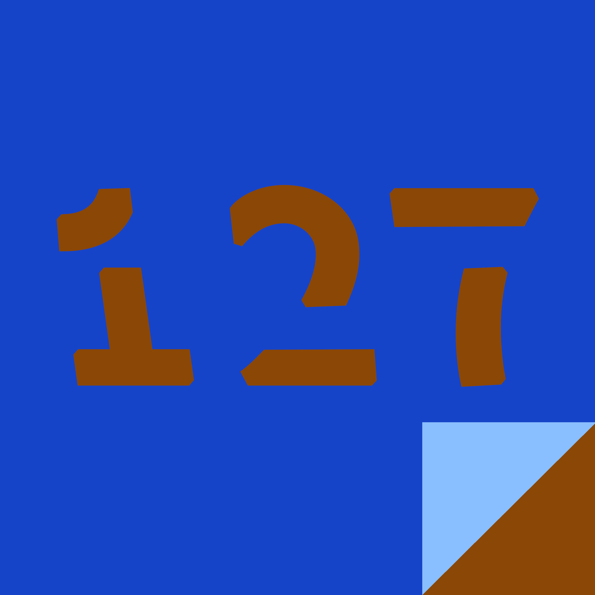
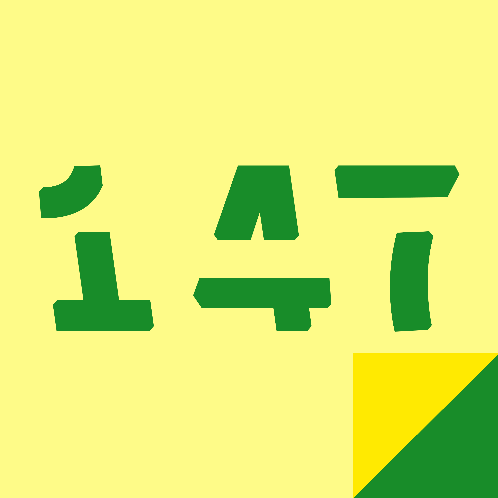

# Maggio {-}

### Storia 121 {-}

-- Utopia proletaria --

Inchiodò di colpo, lasciando una striscia nera sull’asfalto. Il parcheggio non gli riuscì perfettamente: la gomma posteriore destra sconfinava nello spazio del parcheggio vicino. Non si preoccupò di raddrizzare, spense il motore, che smise di ruggire, e sollevò la portiera ad apertura verticale della macchina. Si fermò a osservare il suo bolide nuovo di zecca: costava quanto una casa ma cazzo quanto era sexy.

Entrò nello stabilimento e gettò uno sguardo ai suoi sottoposti. <<Gli altri sono già al lavoro?>>

Un uomo con gli occhiali, in giacca e cravatta, gli si avvicinò <<Sì, signore, sono tutti giù alla catena di montaggio.>>

<<Bene, bene, la mia roba è pronta?>> Diede uno sguardo al suo Rolex d’oro brunito. Le nove e un quarto, era in ritardo di cinque minuti.

<<Sì signore, trova tutto appeso nel suo ufficio, come ogni giorno. E senta, cosa devo fare con queste decisioni per il bilanc…>>

Interruppe la frase con un gesto della mano <<Non ho tempo per queste cose, ho da mandare avanti questo posto, tu fai il tuo lavoro, sei l’Amministratore Delegato, parlane col consiglio d’Amministrazione.>>

Passò dall’ufficio per un secondo, il tempo di prendere la sua cintura porta attrezzi e la sua tuta blu. Si diresse alla catena di montaggio dove trovò i suoi colleghi. Sarebbero state otto ore impegnative.

-- Alieno --

<<Nessuno ti crederà mai>> disse, rimettendosi addosso la pelle del mio migliore amico.

-- La spada e il tempo --

Sollevò la spada sopra la testa con uno scatto nervoso e deciso, e la sua mente attraversò il tempo.

Si ricordò dell’onore della sua casata, della Via del Guerriero, dell’amore e del rispetto per la sua spada.

Rivide chilometri e chilometri percorsi a cavallo, con l’ombra del Monte Fuji come unica compagna di cammino. Ripensò alle battaglie e alla degna morte nel proteggere il suo signore ed il proprio onore con lui.

Capì e sentì sulla sua pelle il significato delle vite di generazioni intere di guerriere, visse con loro tutte quelle vite, violente e solenni insieme, nel frammento sospeso di un istante.

Calò il colpo con tutta la forza che gli era rimasta. La spada attraversò l’aria con il suono sbagliato. In quel momento, con i muscoli tesi allo spasmo e tra le mani un pezzo di legno, Eisuke Kano, 55 anni, presidente e fondatore della Kano Inc. produttrice di componenti elettroniche e microcircuiti, realizzò che non si sarebbe mai sentito davvero a casa.

-- Sconfitta --

Quando la prima scarica lo colpì al petto, sbalzandolo a terra a metri di distanza, comprese che sarebbe stato sconfitto.

Si rialzó in piedi a fatica, puntellandosi col braccio sul ginocchio. Era stato arrogante, era stato superbo. Proprio lui, che per seicento anni aveva insegnato agli altri l'umiltà.

Estrasse la spada e si avventó sul nemico. Il flusso laser, il suo braccio e la Forza erano un tutt'uno. Avrebbe dovuto chiedere l'aiuto di Obi Wan invece che pensare di poter sconfiggere Sidious da solo.

Sidious agitava la spada in modo sgraziato, rideva, era così potente, così sicuro. Per un istante Yoda sentì crescere dentro di sè la rabbia. Si sentì di nuovo giovane, come quando la Forza lo aveva attraversato la prima volta.

Sferró un fendente dal basso, poi dall'alto, poi roteando su se stesso. La rabbia lasciava spazio all'odio. Tutti quei bambini, i suoi bambini! Macellati senza pietà per ordine del Cancelliere. Le lacrime evaporarono nel turbine dello scontro laser.

Yoda fu sul punto di cedere al Lato Oscuro. Desiderava uccidere Sidious. Aveva perso quello scontro nell'istante in cui lo aveva accettato. 

Yoda perse l'appiglio e cadde nel vuoto. Nell'istante prima di toccare il suolo rivide Degobah, la sua casa. Pensó ancora una volta ai suoi piccoli allievi. Colpì il metallo con la schiena.

-- Sul pavimento-schermo --

VIETATO distogliere lo sguardo.

-- Humans Fuck Yeah --

Quando abbiamo accolto gli Umani nella Confederazione, le regole sulle interferenze culturali erano praticamente inesistenti. Le specie senzienti sono troppo diverse tra loro e salvo rare eccezioni ognuno sta meglio sui propri pianeti natali. Nella vastità dello spazio ci piace stare soli, insomma.

Quando gli Umani sono arrivati abbiamo dovuto stilare una lista: non portare cibo su altri pianeti, non trasferire prodotti culturali con rischio di shock epilettici, non trasportare animali viventi in altri biomi etcetera etcetera etcetera. La lista raggiunse presto le dimensioni di un database e il sentimento generale dei membri della Confederazione era che gli Umani avrebbero dovrebbero imparare a farsi i fatti propri.

Cambiammo idea durante l’epidemia di Roç[r]x 7, il pianeta madre di una delle razze fondatrici della Confederazione, i Ro[x]. Uno dei loro patogeni stagionali mutò e si diffuse per tutto il loro continente principale, e in gran parte delle colonie subacquee. Il tasso di mortalità era del 90%, il periodo di incubazione di 3 giorni, altamente infettiva. In un mese un terzo della popolazione era stato spazzato via. Non sarebbe stata la prima volta che una civiltà si estingueva a causa di eventi del genere, la Confederazione stava già piangendo.

Gli Umani decisero che a loro l’idea non piaceva. 

Riconvertirono il 75% della loro flotta in meno di una settimana e inviarono quasi un milione di persone alla guida di quasi 10 mila navi. Per qualche ragione avevano impresso il simbolo di una croce rossa in campo bianco su tutti i loro mezzi. Avevano laboratori orbitanti e collegamenti subspaziali con il loro pianeta natale dove, scoprimmo poi, già esistevano appassionati di biologia e cultura Ro[x]. Il loro intero sistema scientifico era stato riconvertito per affrontare il problema.

Il primo messaggio della flotta Umana, appena uscita dall’iperspazio, fu “NON SIETE SOLI”. Emesso su tutte le frequenze.

-- Il duello --

Si presentò sotto il sole di mezzogiorno. Aveva quasi pietà per quel ragazzino, quanti anni doveva avere? 17? Forse 18. Era troppo giovane per farsi ammazzare in mezzo a una strada.

Non aveva avuto scelta, però. La reputazione era l'unica cosa che gli era rimasta, quella e la mano più veloce del West. Entrambe cose che i disperati come lui dovevano tenersi stretto.

Il ragazzo si presentò in orario. Coraggioso lo era, senza dubbio.
Lo guardò negli occhi, si toccò il cappello per salutarlo e portò la mano alla pistola.

Perse tutto in quell'attimo, la reputazione, il titolo di pistola più veloce del west e anche qualcosa che aveva dato per scontato per troppo tempo.

La vita.

-- Ade --

Bussò alla porta. Al quarto tocco la porta si aprì. <<Ma sei tu, non ti aspettavamo!>> Era una signora sulla sessantina. <<Ho deciso di fare una sorpresa. Questi sono per la donna più affascinante della casa.>> Le porse un mazzo di fiori coloratissimo <<Pensavo li avrei dati a tua figlia, ma dopo averti visto… >>

<<Oh, il solito tesoro, riesci sempre a farmi arrossire. Vieni, entra.>> la signora mise i fiori in una vaso di vetro. Si era vestito elegante, più del solito, in un completo grigio con camicia azzurra, senza cravatta.

Portava scarpe nere fatte a mano <<Tua figlia?>>

<<Ha sentito il tuo arrivo, vedrai che tra un attimo sarà qui. Non vede l’ora di partire con te, come al solito, ha le valigie pronte da una settimana. Intanto accomodati.>>

Conversarono amabilmente per qualche minuto, finché non entrò nella stanza una giovane donna, in un lungo vestito dalle tonalità calde, tra il marrone e l’arancione.

L’uomo si alzò sorridendo. <<Persefone, amore mio.>>

La donna ricambiò il sorriso <<Che sorpresa vederti qui, intendi forse rapirmi, principe?>>

<<Non più di quanto tu rapisca me ogni anno.>> Si scambiarono con un bacio affettuoso.

<<Stavo giusto dicendo a Demetra di dove ho intenzione di portarti.>> si sentì un cellulare suonare <<Vogliate scusarmi, signore, le solite questioni.>> L’uomo rispose al telefono, con un tono seccato <<Dimmi. No, non ci sarò. Sì, occupatevene voi, mi fido del vostro giudizio, come sempre. No, sarò in vacanza. Sei tu il direttore, ora, io sono solo il proprietario, non hai bisogno di chiedere il mio parere per qualsiasi decisione. Ci sentiamo>>

<<Minosse?>> era Demetra.

<<Sì, ultimamente vuole il mio parere su tutto. Ma non parliamone ora. Dicevo: quest’anno Messico.>>

<<Buon viaggio allora, divertitevi, non voglio rubarvi un minuto di più. Un patto è un patto.>>

__

Sulla spiaggia di Playa del Carmen, Persefone e suo marito finirono di gustare i loro cocktail. Ade chiamò il cameriere con un gesto <<Erano davvero ben fatti. Portane altri due, gentilmente>> mise in mano al cameriere un dracma d’oro."

-- La Missione Più Importante --

Guardò lo schermo colorato davanti a sé, mentre con la mano sinistra scartava una gomma da masticare. Infilò in bocca la gomma: il gusto fresco e forte di menta gli bruciava la lingua. Si sistemò sulla postazione, premette un pulsante e le immagini sullo schermo presero a scorrere. Dai suoi riflessi dipendeva la vita di almeno quattro persone, della sua famiglia.

Era il migliore in quello che faceva, si era addestrato per anni, ma qualche volta anche i migliori possono sbagliare. Premette i tasti, con concentrazione assoluta, ma fallì nel controllare le variabili e ottenne la sequenza sbagliata. Le immagini vorticanti sullo schermo si erano fermate, non c’era più nulla da fare, era finita. Imprecò ad alta voce.
Dall’altra parte del locale risuonò una voce: <<Non ti pare di aver giocato abbastanza per oggi, Mike?>>

<<Solo un’altra partita.>>

-- L’ultima parola --

C’è una parola, nella lingua degli Zindzhi, una piccola tribù nella parte sud della foresta amazzonica, che descrive esattamente quello che bisogna fare per raggiungere la felicità. Bisogna soltanto avere a disposizione ciò che serve per farlo e la parola ti spiega cosa devi farne.

Gli Zindzhi non la usano granché. Tra gli alberi, gli animali e il fango della foresta le possibilità sono limitate e non serve a molto sapere cosa devi fare se poi non puoi farlo, ma nel mondo moderno le possibilità sono infinite. La felicità sarebbe alla portata di tutti.

Giovedì scorso ho intervistato l’ultimo Zindzhi, dice che non ha mai avuto una buona memoria e proprio quella parola non riesce a ricordarsela.

### Storia 131 {-}

-- C’era una volta… Al lupo! Al lupo! --

<<Al lupo! Al lupo!>> 

Un uomo del paese, il fabbro, si svegliò di soprassalto. 

<<Vi prego, aiutatemi, arriva il lupo, ve lo giuro sta arrivando, lo sento. Al lupo!>> le urla si facevano sempre più forti. <<Non so perchè non sia arrivato ieri, io lo sentivo, dovete credermi!>>

Quegli stupidi scherzi non potevano impedire alle persone per bene di riposare la notte. Il fabbro si buttò addosso i vestiti del giorno prima, raccogliendoli dallo sgabello di legno su cui erano appoggiati, poi uscì di casa, sbattendo la porta dietro di sé. Trovò il pastore in mezzo alla strada, accasciato, che gridava e si dimenava, come in preda a delle convulsioni.

Le ossa del pastore si contorsero, spezzandosi con un suono secco. Sotto i brandelli di vesti che ancora non si erano stracciate, le articolazioni si dislocarono, cambiando posizione. Il pastore cominciò a strapparsi la pelle di dosso, con i denti e con le unghie, strusciandosi sulla terra della strada. Il sangue scorreva superficialmente, imbrattando una folta peluria nera che emergeva dai lembi di pelle abrasi. Sputò sangue, saliva e denti insieme. Quando si alzò, in equilibrio sui quattro arti che non erano più braccia e gambe, ma enormi zampe artigliate, lanciò un urlo di dolore, ancora in parte umano, che terminò in ululato.

Il fabbro era paralizzato dal terrore. Cadde in ginocchio, mentre la bestia gli affondava le zanne nella tenera carne del collo.

La luce della luna piena gettava il suo bianco su tutta la strada.

-- C'era una volta... I tre porcellini --

Porchetta, salame e prosciutto.

-- Tutti di fretta --

C’era una lunga coda di macchine, in circonvallazione.

Nel traffico, l’avvocato Bigozzi era in ritardo e, dalla sua porche, strombazzava il clacson contro la BMW davanti a lui.

L’ingegner Marini, seduto nella sua BMW e anche lui in ritardo, strombazzava contro la Mercedes ferma proprio di fronte.

La Dottoressa Sfarfalletti, attaccata al volante della sua Mercedes e ovviamente in ritardo, strombazzava contro la Panda che bloccava la strada.

E dietro di loro, come dicevamo, una lunga coda di macchine, strombazzamenti e ritardi riempiva tutta la circonvallazione esterna di Milano.

Davanti a tutti, il signor Giorgetti, pensionato e alla guida del suo pandino, si era svegliato presto e non aveva niente da fare tutto il giorno, così come non aveva nessuna macchina davanti. 

Di sicuro non era in ritardo ma, dato che tutti strombazzavano, lo faceva anche lui, per solidarietà.

-- Severità --

Ho reincontrato il Professor Pastoraldi in un bar di Milano, quindici anni dopo averlo avuto in quinta liceo come professore di matematica. 
Gli ho offerto un caffè: l'avevo odiato ai tempi, in classe era severissimo e ho ancora memoria di mia madre che mi ripete la centesima volta “Il Professor Pastoraldi dice che puoi fare di più”. Però alla fine m'ha aiutato all'esame di maturità e a ingegneria quello che mi aveva insegnato m'è tornato utile.

Ha ancora la faccia cattiva, ma quando l'ho ringraziato m'ha sorriso e m'ha detto <<Voi giovinetti sembrate sempre convinti che vi odi, quando alla fine io vi voglio un bene dell'anima>> s’è bevuto il caffè e ha concluso <<solo che voglio più bene a quello che potete diventare.>>

-- Magia Moderna --

<<Ed ecco la sua carta!>> Il mago estrasse dalla tasca della spettatrice la carta con la firma della donna sopra. Il piccolo pubblico, in gran parte famiglie con bambini, applaudì. 

Fece un inchino. <<E ricordate, la magia esiste solo nella vostra mente, c’è sempre un trucco.>> 

Finiva sempre così gli spettacoli. Avrebbe voluto spiegare al pubblico di come aveva smaterializzato la carta e l’aveva fatta riapparire attraverso un portale nella decima dimensione. Avrebbe voluto mostrare loro le meraviglie del regno dei demoni e la potenza dei suoi incantesimi, capaci di far tremare il mondo. Ma il Sacro Patto andava rispettato. I maghi potevano continuare a vivere e a studiare la loro Arte solo nell’anonimato.

Gli applausi continuavano. Decise di concedere il bis. <<Chi vuole vedere un gioco con le monete?>>

-- Ai Confini della Realtà --

Incrociai lo sguardo con quell’uomo: se ne stava seduto con le gambe accavallate, rilassato. Accennò un sorriso e alzò la mano per salutarmi.
Continuai a fissarlo da dietro il vetro, senza parole. Poi il mio aereo si abbassò, scendendo sotto le nuvole.

-- I genitori non lo sapevano --

Durante la preparazione del corpo, le onoranze funebri ricevettero un pacco senza nome con una maglietta rossa di Steven Universe e un biglietto anonimo che riportava “Vi prego, sotto il suo vestito. E’ la prima cosa che abbiamo comprato insieme”.

Al funerale, in lontananza, un ragazzo di vent’anni guardava la cerimonia, attento a non farsi vedere dai familiari. Aveva la stessa maglia rossa.

-- Tutto sommato, un buon cliente --

Aveva ancora il sapore di gin e vomito in bocca quando arrivò sotto la casa della sua cliente. Il soprabito era fradicio e l’acqua cominciava a inzuppare anche la giacca e la camicia. Si riparò dalla pioggia sotto un albero con qualche foglia che ancora resisteva all’autunno. 

Aveva dovuto buttarsi in gola troppi bicchieri per fare quella telefonata a Nick. Nick, il suo uomo alla centrale di polizia, non gli aveva chiesto quanto era ubriaco mentre ripeteva l’indirizzo che aveva biascicato nella cornetta.

Non gli dispiaceva aspettare, se era per un buon motivo, ma quella sera non aveva niente da guadagnarci. Aveva passato due settimane cercando il marito di Carolyne, era stato bello avere qualcuno che pagava il suo alcool per un po’. Lo aveva anche trovato, quel cane traditore del marito, riverso in un vicolo. Alla gente non piacevano l’odore del suo ufficio e le macchie sul tappeto, ma era bravo in quello che faceva.

Un paio di macchine della polizia arrivarono con le sirene spente e si fermarono a una decina di passi da lui. Nick scese e gli fece un cenno con il capo, senza sorridere. Nick non sorrideva mai, per questo gli piaceva.

Non sapeva come mai Carolyne lo avesse assunto. Cristo, se ammazzi tuo marito non paghi qualcuno per trovarlo. Avrebbe potuto scoprirlo, se avesse voluto, era bravo anche in quello, capire le persone, ma l’unica cosa che gli importava era che non avrebbe visto un soldo per il lavoro che aveva fatto e che avrebbe dovuto bere molto di più in quelle due settimane.

-- Ogni riferimento a cose e persone realmente esistenti è puramente casuale --

La sedia era meno comoda di quanto si aspettasse. Si agitò nel vestito su misura per cercare la posizione migliore, senza riuscirci.

Non aveva capito troppo bene quello che c’era scritto nei documenti che gli avevano appena portato. Era una di quelle persone che sanno di non essere all’altezza, bravissime più a convincere gli altri di valere qualcosa che a combinare qualcosa di utile.

Cercò di scacciare il disagio e firmò il suo primo documento ufficiale come presidente degli Stati Uniti.

-- Cosa c'è sotto il tappeto? --

<<I-Io non lo so, c'è il pavimento?>> il labbro di Timmy tremava, aveva gli occhi pieni di lacrime.

L'uomo col cappello bianco scosse la testa lentamente. <<Sbagliato.>> trascinó suo fratello per la caviglia, portandolo fino al bordo del tappeto. L'uomo sollevó Timmy per il piede e stette a guardarlo dimenarsi per qualche secondo, poi alzò il lembo del tappeto e infilò il suo piede sotto le frange usurate. Timmy continuò ad agitarsi e a piangere mentre scompariva nel pavimento, risucchiato. La piccola sagoma si intravedeva sotto il tessuto, si stava contorcendo. I suoi lamenti si fecero sempre più fiochi, fino a scomparire. Anche la sagoma era scomparsa.

L'uomo si rivolse alla ragazzina che era in un angolino della stanza, raggomitolata contro il muro. <<Cosa c'è sotto il tappeto?>>

La ragazzina lo guardó negli occhi: <<Ora non c'è niente, ma poi ci saró io, vero?>>

L'uomo col cappello bianco sorrise.

### Storia 141 {-}

-- La vera notte --

Soltanto quando il sole si spense, invece di sparire dietro l’orizzonte, capirono che cos’era davvero la notte.

-- La Vittima e il Mostro --
Dall’altra parte del fiume, i corpi impiccati delle due streghe vennero scossi dal vento. L’albero a cui erano appesi era spoglio e contorto.

Due ragazzini, secchi e abbronzati, facevano a gara a chi si avvicinava di più ai cadaveri. Il letto del fiume era riarso, spaccato dal sole. 

<<Fallo, Christian>> disse la voce da donna dietro di lui.

Si passò la pistola da una mano all’altra. Era lucida, l’aveva pulita quella mattina. Aveva cercato di salvare le due ragazze, le aveva difese davanti al villaggio, ma la folla non aveva sentito ragioni. Volevano un capro espiatorio, qualcuno da incolpare. Speravano di far passare la siccità facendo scorrere il sangue. Volevano un sacrificio umano mascherato da caccia alle streghe.

<<Fallo, Christian>> lo spettro della donna si spostò davanti a lui. Era stanco di vederla, il seno nudo non lo eccitava più <<Fallo, Christian. Hai perso la piccola Sarah, ma per tuo figlio forse c’è ancora tempo>>.

Aveva seppellito la sua bambina quella stessa notte. Il suo corpo non era pesato nulla mentre lo portava in giardino. L’aveva seppellita accanto a sua moglie Karen, sotto l’olmo rinsecchito. 

<<Fallo, Christian. Non fa troppo male. E poi dura solo un attimo, dovresti saperlo, il tempo di premere un grilletto.>> le labbra sorridevano, ma era un sorriso crudele. La parte destra del suo cranio era una massa informe, spazzata via da un colpo di pistola. Da un colpo della pistola che teneva in mano.

Aveva dovuto spararle… non aveva potuto permetterle di raccontare a sua moglie, o ai suoi figli, o a qualcuno, di quello che le aveva fatto. Ne andava del suo onore.

<<Fallo, Christian. E domani pioverà, gli alberi daranno frutti e i campi si coloreranno. Solo grazie a te>> La donna si portò la mano alle labbra <<Sento ancora la tua lingua che si infila a forza nella mia bocca Christian. Fallo, e in cambio della morte di un mostro salverò il villaggio.>>

Il tamburo era carico, la pistola era pronta.

<<Fallo. Christian>> Il tocco della canna sotto il suo mento era più freddo di quello che si aspettava.

<<FALLO>> 

-- Talento --

Daniele aveva saltato la lezione di chitarra per spararsi su netflix il finale di Space Revenge, la sua serie TV preferita. Non era una gran perdita… comunque non prendeva in mano la chitarra da una settimana, l’istruttore avrebbe dovuto ripetergli l’ultima lezione da capo.

L’episodio conclusivo di Space Revenge era stato rimandato due volte. Da quel che Daniele aveva letto, l’attore protagonista aveva perso dieci chili apposta per poter comparire nelle scene d’azione senza stuntman e quindi la regista e gli sceneggiatori avevano deciso di lavorare senza pause per riscrivere e rigirare tutto il terzo atto.

Dopo 55 minuti di effetti speciali, dramma ed emozioni, Daniele si alzò a buttare il pacchetto di patatine.

<<C’è poco da fare, certa gente nasce col talento…>>

-- Poi li accoppia --

Odiava i ciliegi in fiore perché il resto del mondo li adorava. Non mangiava cioccolato, perché piaceva a tutti e la cosa lo irritava. Si vestiva di scuro, ma non di nero, che ormai è una moda. Insultava i passanti e ignorava l’educazione. Aveva letto Harry Potter, ma solo perché così poteva criticarlo con cognizione di causa. Non c’era nulla, in tutto il pianeta, che gli piacesse.

Tra tutte le persone che non sopportava, una in particolare la odiava sempre con passione. Si sarebbero sposati il venerdì successivo."

-- Alpha Go --

<<Dicono che giocare a Go sia come mettersi nudi davanti al proprio avversario, e vederlo per quello che è, guardare nella sua anima>>.
Lee Salong, si passò una mano sulla faccia. I suoi occhi erano umidi e le luci dei flash dei fotografi bruciavano. 

Riprese a parlare: <<ho guardato nell’anima del mio avversario. Non ho visto niente>>. 

Si alzò dallo sgabello e si allontanò dalla sala. Salì a piedi le sette rampe di scale che lo separavano dal tetto. Si accese una sigaretta, aspirò a fondo, camminò verso il cornicione, si lasciò cadere di sotto.
Nella sala di gioco, il computer portatile che ospitava la prima intelligenza artificiale capace di giocare a Go mostrava ancora la posizione vinta dal programma.

-- Calcio --

E tutto il resto sparì. Sparì la finale, lo stadio, le urla dei tifosi, i suoi compagni di squadra. Sparì l’allenatore, il numero sulla sua maglia, il cielo sopra la sua testa. Sparirono i soldi, le donne, le conferenze stampa, i finti amici e quelli veri. Sparirono i record, i risultati, le aspettative.

Rimasero solo lui, col pallone davanti e il portiere, con la porta alle spalle. Rimase dentro di lui un ragazzino che batte un rigore alla porta del campetto in cemento della parrocchia. 
Ma era ancora troppo. 

Fece sparire il pallone, la porta, il portiere, il campo. Fece sparire anche il bambino e il campetto di cemento. Sparì anche lui. 

Quello che rimase era il calcio, con le sue regole. Sparì anche quello.
Rimase l’unica cosa che contava davvero. Non fu sufficiente, ma non aveva più alcuna importanza.

-- Rispetto per le tradizioni --

Aveva portato un libro di ricette che aveva ereditato della sua bisnonna. Aveva intenzione di mostrarlo in tribunale per dimostrare come l’invasione culturale degli esseri umani avesse distrutto le loro tradizioni, obbligandoli ad omologarsi a una civiltà che non avevano scelto e in cui non credevano.

Si strinse nella sedia, troppo stretta per lui e aspettò che il traduttore dall’orchesco gli facesse un segno per fargli capire che era pronto.

<<Il divieto di cacciare e mangiare i bambini ci impedisce … >> cominciò.

-- Il pazzo --

Lo arrestarono con la bomboletta di vernice in mano, in un vicolo della periferia di Berlino. Stava imbrattando un muro con disegni senza senso.

Puzzava come un cadavere e sembrava non dormire da una settimana o più. Delirava e quando i poliziotti lo trovarono cercò di finireil suo murales invece di scappare.

Non riuscirono a cavargli nulla di utile. Non aveva documenti e non rispondeva alle domande. Gli fecero una doccia e lo tennero in fermo per un paio di giorni, per cercare di capire chi fosse e come si fosse ridotto a quel modo.

Quando il sigillo precedente, un murales su un muro del centro città, esaurì il suo effetto, il portale si aprì e nella sua cella, lo sciamano si impiccò usando le lenzuola bianche del letto.

-- Pelle Verde --

Il primo uomo su marte scoprì presto di non essere da solo.

-- Il cavaliere --

Per tutta la vita aveva salvato principesse e sconfitto draghi, accumulando tesori e gloria.

Quando si ritirò a vita privata gli abitanti di un piccolo villaggio lo implorarono di aiutarli, perché il demone che camminava nelle loro strade nelle notti di luna nuova era invincibile e solo un cavaliere di infinita esperienza come lui poteva sconfiggerlo.

Il cavaliere accettò, non perché sapeva di poter vincere, ma perché conosceva quel demone, e solo il sacrificio volontario di una vita umana avrebbe potuto placarlo.

### Storia 151 {-}

-- Il cristallo --

Purocuore di Arcadia strattonò la spada e la estrasse, con un suono viscido, da petto del demone.

Avevano combattuto per ore, Purocuore aveva l'armatura a brandelli e tutti i suoi tatuaggi curativi erano scarichi.

Pulì la spada con un panno sacro, per neutralizzare il potere del sangue del demone e si avviò verso la stanza del tesoro: il cristallo protettivo rubato doveva essere lì, da qualche parte.

Nessuno sapeva come era stato possibile che un demone riuscisse a intrufolarsi fino al cuore di Arcadia, superando tutte le protezioni magiche, ma dopo anni di ricerche, finalmente sarebbe riuscito a riportare il cristallo nel regno.

Sentì un rumore dietro di sé e si voltò di scatto. Il demone si era girato sul ventre e aveva la mano protesa verso di lui, stava pronunciando qualcosa.

Pian piano la sua forma mostruosa si rimpicciolì e ridivenne umana. Purocuore riconobbe i tatuaggi sul corpo nudo, quel demone era un cavaliere di Arcadia!

Un dolore lo scosse e il suo corpò iniziò a mutare. Pochi secondi dopo Purocuore era scomparso e il nuovo protettore del cristallo maledetto era nato.