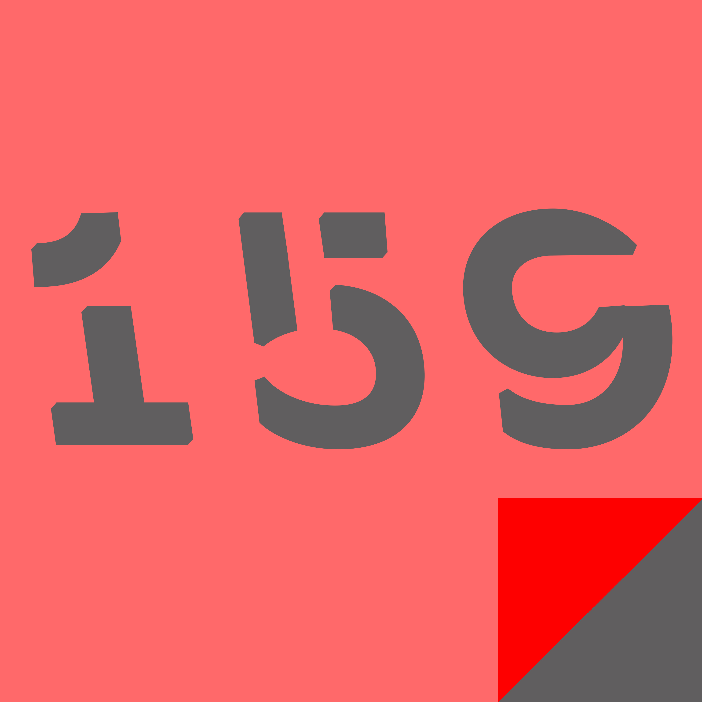

# Giugno {-}

-- Il Supereroe --

Strizzò la pistola con la mano destra e la gettò con noncuranza davanti a sé. Il ladro strabuzzò gli occhi e si gettò in ginocchio.

<<Non uccidermi...>> era bianco in volto e le mani giunte gli tremavano.

<<Aspetta le forza dell'ordine. Non obbligarmi a venirti a cercare.>>

Lasciò il ladro in ginocchio e spiccò il volo. In pochi secondi l'aria fredda sopra la città lo avvolse. Rimase sospeso poco sotto le nuvole, la città sotto di lui era in pace. Le prigioni erano vuote. Tutto grazie a lui.

Il bracciale al suo polso emise un trillo acuto. Sospirò. Era quasi ora dell'evento di quel mese. Un piccolo prezzo da pagare per poter rimanere ben impresso nella mente della popolazione e rendere vendibile la sua immagine pubblicitaria. Chissà che razza di criminale psicopatico aveva reclutato il suo sponsor questa volta...

-- A ognuno il suo --

Guardò LeBron James rovesciarsi in una schiacciata terrificante. Il pubblicò esplose nel piccolo schermo televisivo e lui si esaltò insieme a loro.

Diede un morso corposo alla schiacciata all’olio d’oliva che aveva in mano. Felice.
A ognuno il suo.

-- Fisica Quantistica --

Al tavolo da poker, Dio accettò l'All In dell'avversario e lanciò sul tavolo le sue carte. Scala Reale.

Raccolse le chip e guardò Albert dritto negli occhi.

<<Non gioco a dadi, Albert, dovresti averlo imparato, ormai.>>

-- Il ponte --

Il luogo comune che vivere una vita che valga la pena di raccontare sia la cosa più importante è più vero di quello che si crede.

Oltre le nebbie della morte, dopo aver faticato per liberarsi dai rimasugli della carne, la nostra anima si ritrova davanti a un vecchio ponte di pietra.

Il troll seduto davanti a esso è un vecchio quasi cieco avvolto in una coperta lercia. Quando si alza, raramente, si appoggia al vecchio bastone che stringe tra le mani.

E' un troll tranquillo, con parecchio muschio a fargli da barba e ha un'unica risposta per le anime che vengono a chiedergli "e ora?"

<<Raccontami la tua vita.>>

Se la storia lo soddisfa, si è liberi di attraversare il ponte, se secondo lui la vostra storia non è finita vi rimanda indietro a risolvere i nodi della trama che avete lasciato in sospeso.

E' così che nascono i fantasmi.

-- La vita di una scrittrice di gialli -- 

La signora Fletcher strinse la borsetta mentre il signor Arnold, il proprietario della fabbrica, veniva portato via in manette.

Le sue deduzioni erano riuscite, ancora una volta, a far scagionare suo nipote, e il signor Arnold avrebbe speso il resto della sua vita in galera per omicidio volontario.

L'uomo urlava di essere innocente. Non sarebbe servito a nulla, le prove erano incontestabili. Nessuna giuria gli avrebbe creduto.

Dopo tutti quegli anni passati a inventarsi colpevoli per far rimanere fuori di galera quel sociopatico di suo nipote, la Signora Fletcher ancora non riusciva a capacitarsi di quanto fosse facile ingannare la giustizia.

-- Nessun riposo per i dannati --

Si accese una sigaretta appena l’orologio segnò la mezzanotte. Era il giorno di uscita del suo ultimo album, l’apocalisse sarebbe cominciata non appena il rituale satanico, inciso al contrario sui vinili in vendita, si fosse diffuso nel mondo.

Dopo un mese di attesa dovette accettare il fatto che nessuno era così scemo da far suonare un disco di vinile al contrario.

-- Il clone malvagio --

Suo marito e il suo clone malvagio la fissavano. Clara sparò e, mentre ancora il proiettile era a mezz'aria, si rese conto di aver fatto la scelta sbagliata.

-- Demetra --

Chiuse la porta dietro dietro di sé, infilò i fiori che aveva in mano in un bel vaso e annuì convinta: finalmente se ne erano andati. Voleva bene a sua figlia Persefone, ma la maledizione dell’eternità è che i figli non crescono mai del tutto e che si aspettano che i genitori facciano lo stesso.

Salì in soffitta e aprì il baule invernale. Un profumo dolciastro di fenolo si sparse, non riusciva mai a liberarsene del tutto. No… non voleva liberarsene del tutto.

Prese lo zainetto dal baule e ci infilò il camice, un paio di scarpe comode, il tesserino e il faldone con gli appunti di laboratorio, scese le scale della soffitta e passò in camera da letto. La valigia con i vestiti era pronta, infilata in un angolo. 

Spense la luce e staccò il gas, avrebbe vissuto negli hotel vicini ai laboratori per i prossimi 6 mesi.

Uscì di casa e prese il cellulare, chiamò il suo segretario: <<Jason? Sì, sono io, arrivo domani mattina a Parigi, ti ho mandato una mail con la lista delle biotech che stanno sviluppando progetti interessanti, mettiti in contatto.>> 

Salì in macchina senza staccarsi dal cellulare.

<<In particolare c’è una start up ad Amburgo che ha una buona idea su come adattare Malus Domestica ai territori con precipitazioni sotto i 200 mm annui, prendimi un appuntamento per giovedì. Dovrei riuscire a farli arrivare a fine progetto in un paio di mesi, ma rendi chiaro che voglio una clausola per la diffusione gratuita in zone di mia scelta.>>

Infilò le chiavi e partì. La dea delle messi era tornata.

-- La moglie --

Aprì la porta della camera, il letto era vuoto. Digitò il numero di sua moglie sullo schermo del cellulare, dall’altra parte trovò la voce di un altro.

### Storia 161 {-}

-- Basta poco --

Il cellulare suonò mentre era nella vasca da bagno. Claudia allungò la mano verso i pantaloni piegati sul mobiletto del lavandino. Numero sconosciuto.

<<Pronto?>>

<<Hey, Claudia?>> era la voce di una donna.

<<Sì, con chi parlo?>>

<<Sono Clara… ti ricordi di me? Abbiamo fatto le scuole superiori insieme…>> 
Certo che se ne ricordava, erano stati gli anni più felici della sua vita <<Clara Bergamelli? Sì, ricordo. Che ti serve?>>

<<Io… senti, so che ci siamo perse di vista e che ormai hai la tua vita, col lavoro da avvocato e tutto il resto ma…>> la voce si fece più debole <<ero al supermercato e ho trovato il Blue Ray del remake di IT e ho pensato che quando eravamo ragazze facevamo le notti a guardare film horror ed è passato tanto tempo ma è un peccato e io…>>  ormai era quasi un sussurro <<Niente, scusa, sono fuori luogo. Scusami. Scusa… ciao>>

<<No! Va benissimo! Va benissimo! Mi piacerebbe trovare una sera…>>

<<Davvero?>>

<<Davvero… facciamo settimana prossima? Abiti ancora nella vecchia casa? Quando sei libera?>>

<<Mmm… mercoledì? Giovedì? No, mi sono trasferita con Francesco, sto nel paese vicino… ma il fidanzato lo caccio di casa per la nostra serata! Ti mando l’indirizzo?>>

<<Mercoledì! Certo mandami l’indirizzo! Non vedo l’ora!>>

<<Anche io! Ti mando tutto e ci vediamo mercoledì>>

<<Ciao>>

<<Ciao>>

Claudia si alzò e uscì dall’acqua. Le lamette da barba erano appoggiate sul bordo della vasca. Le buttò nel cestino.

-- C’era una volta… un uomo crudele e il suo servo --

Gli aveva visto fare cose terribili, a quei bambini. Aveva visto sangue e lacrime e dolore e non riusciva a non sentirsi colpevole. In fondo, aveva sempre seguito il suo padrone, passo per passo, gesto per gesto.

L’ombra di Peter tentò di scappare una notte d’inverno.

-- Arianna --

Aveva svolto dietro di sé il filo per riuscire a ritrovare la strada attraverso il labirinto. 

Arianna sbiancò in volto, quando sentì il filo tendersi fra le sue mani.

-- Meglio Salutarsi --

Un giorno incontrai un uomo che non avevo mai visto prima, lo incontrai alla stazione dei treni, mentre aspettavo il solito puzzolente e stracolmo regionale delle sette e trenta per Venezia.

Quando l’uomo mi passò di fianco e i nostri sguardi si incrociarono, si fermò e mi disse: <<Addio.>> Ricordo che aveva un cappotto scuro, un volto anonimo, sulla sessantina.

Gli risposi, domandandogli perché mi dicesse addio dato che non ci eravamo mai incontrati prima. Mi sorrise, fermandosi per alcuni istanti, prima di riprendere a camminare.

<<Pensi a quante persone, a quanti luoghi, a quanti oggetti vediamo ogni giorno. Quanti di questi rivedrà ancora nella sua vita? Nel dubbio, meglio salutarsi.>>

Ricordo che quel giorno, mentre la campagna veneta mi sfrecciava a fianco, fuori dal finestrino del treno, osservai le decine di persone che mi circondavano, in quella carrozza di seconda classe. Avrei desiderato dire addio a ognuno di loro.

-- Amore? --

La ragazza gli si strinse addosso nel letto, abbracciandolo sopra le lenzuola sudate. Il sesso non era stato granché, ma non importava, non era per quello che era lì. Si divincolò e si rivestì con calma, senza preoccuparsi di svegliare la ragazza. Uscì dall’appartamento e scese le scale. Il viaggio in macchina durò una ventina di minuti, con i palazzi grigi che facevano da contorno al cielo dello stesso colore.

Parcheggiò davanti a casa ed entrò. Un profumo di frutta e vaniglia arrivava dalla cucina. Trovò sua moglie che appoggiava una torta sul tavolo, lei lo guardò e sorrise.

Dio quanto l’amava.

-- Cosa non si fa per gli amici --

Smontò dal cavallo, prese la borsa e legò l’animale a un ramo.

Camminò nel terreno fangoso fino a sotto le mura del castello. Si arrampicò sulle pietre scivolose, al freddo.

Usò la cappa nera per mimetizzarsi nell’ombra, evitò le guardie che pattugliavano le mura e scassinò la serratura con i grimaldelli per entrare nel castello.

Attraversò la cucina vuota, afferrò un grembiule sporco e cercò di darsi un tono da servo. Di fece strada nell’oscurità, andando a memoria, fino trovare l’ingresso del sotterraneo.

Scese lentamente e si trovò in uno stanzone con tre persone sedute a un tavolo. Uno degli uomini, il proprietario del castello si alzò in piedi non appena lo vide <<Ci reincontriamo finalmente, ladro che non sei altro>> gli disse, girando attorno al tavolo.

Si avvicinò e gli strinse la mano <<Trovarsi per giocare a poker è diventato sempre più difficile da quando ti sei sposato. Joran.>>"

-- Mentre stai dormendo -- Roberto si addormentò alle 11 e 37, dopo una serata di studio, pensando a quanto sarebbe stato bello svegliarsi tra un mese, dopo la  sessione d’esami. Alle 9 e 15 di mattina la sveglia suonò e Roberto entrò nel panico: era in ritardo, avrebbe dovuto svegliarsi per le 8. Guardò il calendario, che segnava il 2 di Marzo. Era trascorso un mese. Pensò a uno scherzo dei suoi coinquilini, ma internet e sua madre al telefono gli confermarono la strana verità. Scoprì che la sessione d’esami era andata bene, che suo padre si era ripreso dalla brutta caduta e che era ancora single. Così Roberto decise di fare un esperimento. Passò la giornata a pensare e poi la sera andò a letto presto, augurandosi di svegliarsi a luglio, in piena estate. Si svegliò in un letto che non era il suo, fuori dalla finestra una spiaggia che non riconosceva, nel cellulare i messaggi di una ragazza che gli diceva che era stata bene la sera prima. Era come se la sua coscienza avesse oltrepassato il tempo, saltando a un altro momento della sua vita. Qualcuno viveva la sua vita, mentre stava dormendo. Roberto era spaventato. Doveva smetterla, non farlo mai più. Ricostruì la vacanza dai messaggi e dalle foto su Facebook e trascorse una splendida giornata. Fece tardi in discoteca e quando tornò era distrutto e un poco brillo. Non si rese nemmeno conto del pensiero che gli passò per la mente, mentre collassava sul letto -chissà come sarebbe svegliarsi e avere ottant’anni- Scoprì che era estremamente faticoso. Si svegliò alle 5 di mattina, il corpo pieno di dolori e debole, di fianco a lui c’era una donna, vecchia quanto lui, addormentata. Non la conosceva, eppure sapeva di amarla più di ogni altra cosa. Pianse, aveva perso tutta la vita mentre dormiva. Cercò di raggiungere il bagno e scivolò per terra, sbattendo la testa contro un termosifone. Mentre perdeva i sensi, con il sangue che gli imbrattava i capelli grigi, pensò a quanto sarebbe stato bello svegliarsi quella mattina di tanti anni prima, nella sessione di esami. La sveglia suonò alle 8 in punto.

-- Il buio --

Spense la sigaretta sul davanzale della finestra e rimase affacciato con le braccia appoggiate sul marmo. Giù in strada un paio di sagome scure uscivano da una vetrina sfasciata, si portavano dietro qualcosa di grosso. Chissà cosa speravano di farsene. 

Era bello vedere che qualcuno aveva ancora speranza, lui aveva rinunciato a rubare quando il sole non era sorto per la terza mattina di fila.

-- L’ultima e la prima -- 

La musica le batteva nei timpani, nelle tempie, nel petto. Non ricordava neanche quand’era stata l’ultima volta che aveva ballato in una discoteca, dodici, forse quindici anni prima, quando frequentava ancora l’università, prima di ritirarsi dagli studi. La musica era potente, ritmata, sconosciuta, le regalava sensazioni che non sapeva di poter provare ancora. Un tempo si sarebbe preoccupata di farsi notare da qualche ragazzo, sorrise all’idea e continuò a ballare, da sola.

La cannuccia era colorata di rosa, come il drink nella quale era immersa. La granella di ghiaccio le raffreddava il palato. Era il terzo bicchiere. Il barista, un ventenne abbronzato, si sporse dal bancone, appoggiandovi sopra le mani e le si avvicinò:

<<Va tutto bene? Si sente bene?>>

Gli fece l’occhiolino. <<Va tutto a meraviglia!>>

Si ributtò in mezzo alla pista, alzando le braccia verso il soffitto, come il DJ aveva gridato di fare nel suo microfono. Le luci stroboscopiche pulsavano a intermittenza, creando giochi di ombre e luce sui lividi che le coprivano la faccia, le braccia e la coscia sinistra, scoperta sotto ad una gonna cortissima.

Girò su se stessa, ancora con le braccia al cielo. Lo avevano portato via in manette, in quella notte. Aveva fatto quella chiamata, l’aveva fatta davvero, in quella notte di due giorni prima che era stata l’ultima e la prima della sua vita. Avrebbe pianto, se non fosse stata così dannatamente felice.

-- Il paradosso di Fermi --

Il Grande Stratega di Tornoiser prese visione dei dati sullo schermo. -Tecnologia spaziale...- pensò, i dati parlavano di grandi telescopi in orbita, stazioni spaziali e missioni esplorative. -Nel giro di qualche secolo saranno in grado di trovarci, nel giro di un millennio di raggiungerci.- Si rivolse ai suoi colleghi, gli Strateghi delle Dieci Razze, parlando nel trasduttore istantaneo: <<Non possiamo rischiare: dobbiamo andare più lontano.>>

Sulla terra, lo scienziato fissava le stelle con il telescopio più potente della razza umana -Dove sono tutti quanti? Chissà se nell’universo qualcun altro si fa la stessa domanda. Le stelle apparivano lontane, fredde e vuote, come il loro solito.

### Storia 171 {-}

-- Gita a Venezia: Anno 2150 --

Prese con la mano il volantino, raccogliendolo da terra. Pubblicizzava un tour organizzato di Venezia: Piazza San Marco, il Palazzo Ducale, il Ponte dei Sospiri e tutte le meraviglie architettoniche principali della città.

Ogni anno la gente veniva da tutto il mondo per visitare la città nell’acqua, uno dei luoghi più incredibili che si potessero vedere nella vita. -Buffo- pensò, -sono anni che non vedo Venezia.- 

A volte quando abbiamo qualcosa di meraviglioso accanto da sempre ci dimentichiamo di guardarlo.

Si mise il volantino in tasca, ripromettendosi che quell’estate avrebbe fatto il tour. Oltretutto i prezzi erano scesi molto e l’apparecchiatura per le immersioni era compresa nel prezzo.

-- Eredità --

L’aveva visto la prima volta mentre da ragazzino usava il binocolo del padre dall’albero in giardino. Una figura bianca, poco più di una sagoma, che sembrava portare un cappello di qualche tipo.

Ne aveva parlato alla madre, che gli aveva tolto il binocolo e lo aveva mandato in camera sua. Aveva otto anni ed era andato a giocare con la playstation seduto sul letto.

A sedici anni era andato a sciare in montagna con gli amici per la prima volta. C’era una uomo vestito di bianco quasi appollaiato sul picco della montagna accanto, ma nessuno dei suoi amici sembrava vederla.

A ventun anni mentre scattava una fotografia a una coppietta in vacanza gli sembrò di vederlo sullo sfondo.

A ventisei anni lo notò nello specchietto retrovisore della sua macchina, mentre parcheggiava davanti al centro commerciale dove lavorava.

A ventisette anni andò in cura da uno psichiatra per combattere le sue allucinazioni, ormai lo vedeva in fondo alla strada ogni volta che usciva di casa. E sembrava sempre più vicino.

A trent’anni, nel giorno del suo compleanno, sua madre lo chiamò. Era preoccupata che non avessi ancora una fidanzata. Diceva che se non avessi avuto presto un bambino l’uomo col cappello bianco lo avrebbe preso, e che dopo sarebbe toccato a lei.

-- Il deserto dei Tartari --

Diario di guerra - Giorno 2734

Ancora su quelle mura. Ancora fermi ad aspettare un invasore che non arriva mai.

Il colore della sabbia, la pietra della fortezza, il sole che brucia, la pelle secca, gli ordini, la disciplina, il cambio della guardia, il freddo della notte, gli stivali di pelle nera, i fucili che non hanno mai sparato, i binocoli, le distese vuote, il silenzio, la noia infinita che diventa routine, poi abitudine, poi piacere, poi noia ancora.

Così da sette anni. E continuano a non veder arrivare il nemico.

Ancora non hanno capito che stiamo scavando sotto il deserto.

-- Occhio per Occhio --

Un occhio in salute, sul mercato nero, vale 15.000 crediti. Un impianto oculare di basso livello ne costa 500. Anche meno se non sei troppo schizzinoso. Puoi vendere un rene a 10.000 crediti, un polmone a 30.000. Una mano a 50.000.

Nello Slum non si vedono molte persone senza impianti. La tentazione di vendere una libbra di carne per saldare un debito, o per assicurarsi le dosi dei prossimi mesi è troppo forte.

Molti muoiono di setticemia. Sia io che Maria lo sapevamo, quando abbiamo deciso di vendere un occhio ciascuno per comprare una casa fuori dallo Slum, per cercare una vita migliore. Ho portato le pastiglie che il chirurgo ci aveva dato da un amico che sintetizza droghe: erano aspirine a buon mercato, non farmaci antirigetto, io sono sopravvissuto per miracolo. Maria no.

Ho rintracciato il minivan su cui siamo stati operati, per… discutere con il chirurgo. Non è stato semplice: ce ne sono parecchi che girano per lo Slum, tutti uguali: verde smeraldo e troppo puliti. L’ho seguito fino a che non è entrato nella zona Alpha, poi mi son dovuto fermare.

Entrare nella zona Alpha è difficile. Bisogna corrompere la polizia per superare il posto di blocco, e serve comprare e farsi impiantare un chip Alpha. Costa un occhio della testa. Per fortuna ne ho appena venduti due.

-- Player One --

Corri. Corri. Salta. Salta. Attento alla tartaruga. Abbassati!!! Corri, corri, corri, FERMO! Fungo, cresci, corri. Tubo. Salta. Oh, un fiore! Spara e corri, corri e spara. Attento alla tartaruga! Corri. Corri. Ecco la bandierina, finalmente! Ultimo saltoooooooo… fatto!

Oddio il castello. Piano, piano, PALLA DI FUOCO. Pozzo senza fondo. Piano. Salta, salta. Tubo. Corri. Altro tubo. Ponte, tartaruga gigante spinosa: passagli soooottoooo… perfetto, ora prendi l’ascia!

<<Grazie Mario, ma la principessa è in un altro castello>>

-- Mi mancherà mia nonna --

Era da un po’ che non tornavo al paesino della nonna. Quattro case in croce, una parrocchia, un bar. 

Tutti che si conoscono, vita tranquilla, il massimo che sia mai successo qui è che qualcuno si sia fregato di tanto in tanto i soldi della cassetta delle offerte dalla chiesa.

Sono andato dritto dal prete a consegnargli la busta. 400 euro, la nonna ha voluto lasciare alla chiesa del suo paese i pochissimi soldi che le erano rimasti.

Ho posato la busta nelle mani del prete, gli ho sorriso e gli ho letto parte di quello che la nonna ha lasciato scritto nel testamento. Il prete era commosso e mi ha persino abbracciato.

Ho omesso di riportargli la parte in cui la nonna se la rideva per tutti i soldi che ha fregato negli anni dalla cassetta delle offerte.

-- Governo ladro --

Parcheggiò la sua punto rossa a completare una stella satanica a cinque punte con altre nove macchine. Quella disposizione nel parcheggio sotterraneo portava via un sacco di spazio, ma le indicazioni aziendali erano chiare.

Controllò che il fazzoletto avesse la piramide con l’occhio bene in vista e salì le scale fino alla reception. Piero, l’uomo dietro la scrivania, lo riconobbe, ma aspettò comunque che lui eseguisse tutte e diciassette le posizioni delle mani necessarie a farsi riconoscere come dipendente prima di farlo passare.

Arrivato in ufficio spostò il cuore di mucca coperto di sangue secco, avanzato dal rituale del venerdì precedente e accese il pc. Mentre i 666 del codice sorgente si susseguivano sullo schermo guardò l’orologio: erano le dieci e mezza. Aveva un’ora e mezza da passare sui siti di debunking a spargere menzogne per rallentare l’inarrestabile avanzata dei Ricercatori Indipendenti, poi avrebbe ricevuto gli ordini sui terremoti e sulle inondazioni da scatenare nel pomeriggio.

L’urlo infernale che segnava l’arrivo del mezzogiorno arrivò mentre rispondeva fingendo sarcasmo a un uomo di quarantacinque anni che aveva scoperto come fermare le scie chimiche con l’aceto. Sperava che i falsi documenti scientifici per cui i suoi capi avevano pagato tutti quei neolaureati funzionassero o tutto il loro lavoro sarebbe stato vanificato da 1 euro e 15 centesimi di uva andata a male.

Si spostò nella Sala Controllo atmosferico e aprì la busta rosa con il sigillo del governo che gli venne consegnata da un ragazzo effemminato. C’era una lista di luoghi da abbattere con il macchinario HAARP e il tempo atmosferico da programmare per la prossima settimana.

<<Maledizione!>>

Domenica c’erano le elezioni regionali e gli ordini erano di far piovere. Avrebbe dovuto spostare la grigliata.

-- In Miniera --

Soffiò sulla miccia. Invano.

-- Negligenza --

Devo/dobbiamo prendermi/ci una pausa, è necessario. 

Sono quasi seimila anni che Io/Noi mi/ci impegno/iamo per mandare avanti le cose nell’Universo, è una fatica immane, e quegli ingrati degli umani sono solo capaci di male interpretare le mie/nostre parole, massacrarsi fra di loro per sciocchezze e costruire templi di scarsa qualità per cercare di ingraziarsi i miei/nostri favori.

Propongo/proponiamo quindi di concedermi/ci un periodo di vacanza nel SovraUniverso, magari ne approfitto/iamo per andare a trovare mia/nostra madre, sono almeno un trilione di anni che non la vedo/iamo. 

Approvo/iamo la mia/nostra proposta, in fondo su migliaia di anni di servizio un secolo di negligenza non potrà certo nuocere più di tanto.

Sulla Terra corre l’anno cinquemilaottocentosessantacinque; secondo il calendario umano, calcolato da quando mi/ci sono/siamo fatto/i mortale/i per redimere i peccati, è il 1914. 

Lascio/iamo che gli uomini si arrangino per cento anni, vedrò/emo come se la cavano per conto loro.

-- Il blocco dello scrittore --

<<Ti dico che non ce la faccio, non mi viene neanche una frase decente.>> Lanciò una palla di carta che era stata un foglio bianco verso il cestino, mancandolo.

Dall’altra parte del telefono rispose una voce <<Non è possibile, cazzo, non di nuovo. Sei il migliore, lo sai, lo hai fatto mille volte e poi ne hanno parlato tutti. Ogni volta che ti decidi a sbloccarti finisci su tutti i giornali e le riviste con le tue parole.>>

Raccolse da terra la palla di carta e ritentò il tiro, che stavolta andò a segno <<Lo so, lo so, hai ragione. Dai vado a scrivere. A dopo.>>

<<Bravo, fammi sapere come procede. Dobbiamo mandarla entro stasera. A dopo.>>

Prese un nuovo foglio bianco e una matita e cominciò a scrivere: “Se volete rivedere vostra figlia con la gambe attaccate al corpo sarà meglio che teniate fuori la polizia. Dieci milioni, in banconote di piccolo taglio” stracciò il foglio. Una voce di bambina veniva dalla camera di fianco. Gridava e piangeva insieme.

<<Zitta stronzetta, mi devo concentrare.>>

### Storia 181 {-}

-- Insieme --

Guardò l’uomo che amava, l’altra metà di sé, e lo prese per mano: <<Insieme?>>
L’altro abbozzò quel suo mezzo sorriso che lo aveva conquistato, tanti anni prima <<Sempre.>>

Avvolgendo i due uomini, ancora mano nella mano, le fiamme e il fumo si innalzarono, mescolati alle grida della folla.